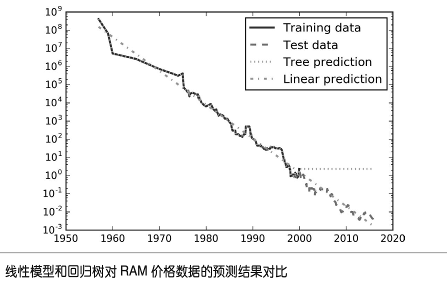
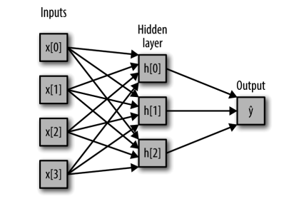

# 监督学习

监督机器学习问题主要分两种：**分类(classification)**与**回归(regression**)

**分类问题** 的目标是预测类别标签(class label)，这些标签来自预定义的可选列表。

- **二分类问题**：两个类别之间进行区分的一种特殊情况，通常将其中一个类别称为正类(positive class)，另一个类别称为反类(negative class)。正类代表研究对象，如邮件分类问题中的垃圾邮件
- **多分类问题**：在两个以上的类别之间进行区分

**回归任务** 的目标是预测一个连续值，编程术语叫作浮点数(floating-point number)，数学术 语叫作实数(real number)


**泛化**：在训练数据上构建模型，然后能够对没见过的新数据(这些新数 据与训练集具有相同的特性)做出准确预测

**过拟合(overfitting)** ：构建一 个对现有信息量来说过于复杂的模型（过分关注训练集的细节，得到了一个在训练集上表现很好、但不能泛化到新数据上的模型）

**欠拟合(underfitting)**：选择过于简单的模型


## k近邻算法

### 一、k临近分类算法

```python
from sklearn.neighbors import KNeighborsClassifier 
clf = KNeighborsClassifier(n_neighbors=3)
clf.fit(X_train, y_train)
print("Test set accuracy: {:.2f}".format(clf.score(X_test, y_test))) 
```

### 二、k临近回归算法

```python
from sklearn.neighbors import KNeighborsRegressor
reg = KNeighborsRegressor(n_neighbors=3)  
reg.fit(X_train, y_train)
print("Test set R^2: {:.2f}".format(reg.score(X_test, y_test)))

```

KNeighbors 分类器有 2 个重要参数:邻居个数与数据点之间距离的度量方法（默认使用欧式距离）

> 📌**优点：模型很容易理解，通常不需要过多调节就可以得到不错的性能。在 考虑使用更高级的技术之前，尝试此算法是一种很好的基准方法。
> 缺点：如果训练集很大(特征数很多或者样本数很大)，预测速度可能会比较慢（对数据集预处理很重要）。对于有很多特征(几百或更多)的数据集往往效果不好，对于大多数特征的大多数取值都为 0 的数据集(所谓的稀疏数据集)来说，这一算法的效果尤其不好。**


## 线性模型

### 一、用于回归的线性模型

对于回归问题，线性模型预测的一般公式为

$$
ŷ = w[0] * x[0] + w[1] * x[1] + ... + w[p] * x[p] + b
$$

这里* X\[0]* 到 *X\[p] *表示单个数据点的特征(本例中特征个数为 *p+1*)，*w *和 *b *是学习模型的

参数，*ŷ* 是模型的预测结果。

### 1、线性回归（普通最小二乘法，ordinary least squares，OLS）

线性回归寻找参数* w* 和 *b*，使得对训练集的预测值与真实的回归目标值 *y *之间的**均方误差**最小。均方误差(mean squared error)是预测值与真实值之差的平方和除 以样本数

```python
from sklearn.linear_model import LinearRegression
X, y = mglearn.datasets.make_wave(n_samples=60)
X_train, X_test, y_train, y_test = train_test_split(X, y, random_state=42)

lr = LinearRegression().fit(X_train,y_train)

#斜率（权重、系数）coef_
print("lr.coef_: {}".format(lr.coef_))
#偏移（截距） intercept_
print("lr.intercept_: {}".format(lr.intercept_))
```

在高维数据集（大量特征的数据集），线性模型变得非常强大，过拟合可能性会变大

### 2、岭归法（Ridge）

系数*w*的选择不仅要在训练数据上得到好的预测结果，而且还要拟合附加约束。我们还希望系数尽量小。换句话说，*w*的所有元素都应接近于 0。(每个特征对输出的影响应尽可能小同时仍给出很好的预测结果).这中约束是**正则化（regularization）**的一个例子

正则化是指对模型做显式约束，以避免过拟合。岭回归用到的这种被称为 L2 正则化。

```python
from sklearn.linear_model import Ridge
ridge = Ridge().fit(X_train,y_train)
```

*Ridge 是一种约束更强的模型，所以 更不容易过拟合。复杂度更小的模型意味着在训练集上的性能更差，但泛化性能更好。*

Ridge模型默认参数 alpha=1.0。alpha 的最佳设定值取决于用到的具体数据集。增大 alpha 会使得系数更加趋向于 0，从而降低训练集性能， 但可能会提高泛化性能。**alpha越大，正则化越强，模型越简单。**

```python
ridge01 = Ridge(alpha=0.1).fit(X_train, y_train)
```

**如果有足够多的训练数据，正则化变得不那么重要**

### 3、lasso

Lasso也是正则化线性回归，不同的是lasso是L1正则化，L1正则化的结果是，使用lasso时 某些系数刚好为 0。（说明某些特征被模型完全忽略。这可以看作是一种自动化的特征选择）

```python
from sklearn.linear_model import Lasso
lasso = Lasso().fit(X_train, y_train)
print("Training set score: {:.2f}".format(lasso.score(X_train, y_train))) 
print("Test set score: {:.2f}".format(lasso.score(X_test, y_test))) 
print("Number of features used: {}".format(np.sum(lasso.coef_ != 0)))
```

Lasso 也有一个正则化参数 alpha，可以控 制系数趋向于 0 的强度。默认值alpha=1.0。alpha降低可以降低欠拟合。同时需要增大运行迭代次数max\_iter***(alpha越小，模型越复杂)***

```python
lasso001 = Lasso(alpha=0.01, max_iter=100000).fit(X_train, y_train)
```

> 📌**在两个模型中一般首选岭回归。但如果特征很多，你认为只有其中几个是重要 的，那么选择 Lasso 可能更好。同样，如果你想要一个容易解释的模型，Lasso 可以给出 更容易理解的模型，因为它只选择了一部分输入特征。scikit-learn 还提供了 ElasticNet 类，结合了 Lasso 和 Ridge 的惩罚项。在实践中，这种结合的效果最好，不过代价是要调 节两个参数:一个用于 L1 正则化，一个用于 L2 正则化。**


### 二、用于分类的线性模型

$$
ŷ = w[0] * x[0] + w[1] * x[1] + ...+ w[p] * x[p] + b > 0

$$

最常见的两种线性分类算法是 **Logistic 回归(logistic regression)**和**线性支持向量机(linear support vector machine，线性 SVM)**， 前 者 在 linear\_model.LogisticRegression 中 实 现， 后者在 svm.LinearSVC(SVC 代表支持向量分类器)中实现。虽然 LogisticRegression 的名字中含有回归(regression)，但它是一种分类算法，并不是回归算法，不应与 LinearRegression 混淆。

两个模型使用了L2正则化

```python
from sklearn.linear_model import LogisticRegression
from sklearn.svm import LinearSVC
```

对于 LogisticRegression 和 LinearSVC，决定正则化强度的权衡参数叫作 C。**C 值越大，对应的正则化越弱**。换句话说，如果参数 C 值较大，那么 LogisticRegression 和 LinearSVC 将尽可能将训练集拟合到最好，而如果 C 值较小，那么模型更强调使系数向量(w)接近于 0。参数 C 的作用还有另一个有趣之处。较小的 C 值可以让算法尽量适应“大多数”数据点，而较大的 C 值更强调每个数据点都分类正确的重要性。

### 三、用于多分类的线性模型

许多线性分类模型只适用于二分类问题，不能轻易推广到多类别问题(除了 Logistic回归)。将二分类算法推广到多分类算法的一种常见方法是“一对其余”(one-vs.-rest)方 法。在“一对其余”方法中，对每个类别都学习一个二分类模型，将这个类别与所有其 他类别尽量分开，这样就生成了与类别个数一样多的二分类模型。在测试点上运行所有 二类分类器来进行预测。在对应类别上分数最高的分类器“胜出”，将这个类别标签返回 作为预测结果。

许多线性分类模型只适用于二分类问题，不能轻易推广到多类别问题(除了 Logistic 回 归)。将二分类算法推广到多分类算法的一种常见方法是“一对其余”(one-vs.-rest)方 法。在“一对其余”方法中，对每个类别都学习一个二分类模型，将这个类别与所有其 他类别尽量分开，这样就生成了与类别个数一样多的二分类模型。在测试点上运行所有 二类分类器来进行预测。在对应类别上分数最高的分类器“胜出”，将这个类别标签返回 作为预测结果。

> 📌**线性模型的主要参数是正则化参数，在回归模型中叫作 alpha，在 LinearSVC 和 Logistic- Regression 中叫作 C。alpha 值较大或 C 值较小，说明模型比较简单。特别是对于回归模型 而言，调节这些参数非常重要。通常在对数尺度上对 C 和 alpha 进行搜索。你还需要确定的是用 L1 正则化还是 L2 正则化。****如果你假定只有几个特征是真正重要的，那么你应该用 L1 正则化，否则应默认使用 L2 正则化****。如果模型的可解释性很重要的话，使用 L1 也会有帮助。由于 L1 只用到几个特征，所以更容易解释哪些特征对模型是重要的，以及这些特征的作用。
> 
> 线性模型的训练速度非常快，预测速度也很快。这种模型可以推广到非常大的数据集，对稀疏数据也很有效。如果你的数据包含数十万甚至上百万个样本，你可能需要研究如何使用 LogisticRegression 和 Ridge 模型的 solver='sag' 选项，在处理大型数据时，这一选项比默认值要更快。其他选项还有 SGDClassifier 类和 SGDRegressor 类，它们对本节介绍的线性模型实现了可扩展性更强的版本。
> 
> 线性模型的另一个优点在于，利用我们之间见过的用于回归和分类的公式，理解如何进 行预测是相对比较容易的。不幸的是，往往并不完全清楚系数为什么是这样的。如果你的数据集中包含高度相关的特征，这一问题尤为突出。在这种情况下，可能很难对系数做出解释。
> 
> ****如果特征数量大于样本数量，线性模型的表现通常都很好。它也常用于非常大的数据集， 只是因为训练其他模型并不可行。但在更低维的空间中，其他模型的泛化性能可能更好****。**


## 朴素贝叶斯分类器

类似线性模型，训练速度更快。泛化能力比LogisticRegression 和 LinearSVC稍差

它通过单独查看每个特征来学习参数，并从每 特征中收集简单的类别统计数据。scikit-learn 中实现了三种朴素贝叶斯分类器: GaussianNB、BernoulliNB 和 MultinomialNB。**GaussianNB **可 应 用 于 任 意 连 续 数 据， 而 **BernoulliNB** 假定输入数据为二分类数据，**MultinomialNB **假定输入数据为计数数据(即每个特征代表某个对象的整数计数，比如一个单词在句子里出现的次数)。BernoulliNB 和 MultinomialNB 主要用于文本数据分类。

> 📌**MultinomialNB 和 BernoulliNB 都只有一个参数 alpha，用于控制模型复杂度。alpha 的工作原理是，算法向数据中添加 alpha 这么多的虚拟数据点，这些点对所有特征都取正值。这 可以将统计数据“平滑化”(smoothing)。****alpha 越大，平滑化越强，模型复杂度就越低****。 算法性能对 alpha 值的鲁棒性相对较好，也就是说，alpha 值对模型性能并不重要。但调 整这个参数通常都会使精度略有提高。
> GaussianNB 主要用于高维数据，而另外两种朴素贝叶斯模型则广泛用于稀疏计数数据，比 如文本。MultinomialNB 的性能通常要优于 BernoulliNB，特别是在包含很多非零特征的数 据集(即大型文档)上。
> 朴素贝叶斯模型的许多优点和缺点都与线性模型相同。它的训练和预测速度都很快，训练 过程也很容易理解。该模型对高维稀疏数据的效果很好，对参数的鲁棒性也相对较好。朴 素贝叶斯模型是很好的基准模型，常用于非常大的数据集，在这些数据集上即使训练线性 模型可能也要花费大量时间。**


## 决策树

决策树也可以用于回归任务，使用的方法完全相同。预测的方法是，基于每个结点的测试 对树进行遍历，最终找到新数据点所属的叶结点。这一数据点的输出即为此叶结点中所有 训练点的平均目标值。

防止过拟合有两种常见的策略:一种是及早停止树的生长，也叫**预剪枝(pre-pruning)**; 另一种是先构造树，但随后删除或折叠信息量很少的结点，也叫**后剪枝(post-pruning)**或 **剪枝(pruning)**。预剪枝的限制条件可能包括限制树的最大深度、限制叶结点的最大数目， 或者规定一个结点中数据点的最小数目来防止继续划分。**scikit-learn 的决策树在 DecisionTreeRegressor 类和 DecisionTreeClassifier 类中实现。 scikit-learn 只实现了预剪枝，没有实现后剪枝。**

**决策树分类**

```python
from sklearn.tree import DecisionTreeClassifier
from sklearn.datasets import load_breast_cancer

cancer = load_breast_cancer()
X_train,X_test,y_train,y_test = train_test_split(cancer.data,cancer.target,stratify=cancer.target,random_state=42)
tree = DecisionTreeClassifier(max_depth=4,random_state = 0)
tree.fit(X_train,y_train)
print("Accuracy on training set: {:.3f}".format(tree.score(X_train, y_train))) 
print("Accuracy on test set: {:.3f}".format(tree.score(X_test, y_test)))

#查看重要程度
print(tree.feature_importances_) 
```

**决策树回归**

**DecisionTreeRegressor**(以及其他所有基于树的回归模型)不能外推(extrapolate)，也不能在训练数据范围之外 进行预测。

```python
from sklearn.tree import DecisionTreeRegressor 
# 利用历史数据预测2000年后的价格
data_train = ram_prices[ram_prices.date < 2000] 
data_test = ram_prices[ram_prices.date >= 2000]
# 基于日期来预测价格
X_train = data_train.date[:, np.newaxis]
# 我们利用对数变换得到数据和目标之间更简单的关系 y_train = np.log(data_train.price)
tree = DecisionTreeRegressor().fit(X_train, y_train) 
linear_reg = LinearRegression().fit(X_train, y_train)
# 对所有数据进行预测
X_all = ram_prices.date[:, np.newaxis]
pred_tree = tree.predict(X_all) 
pred_lr = linear_reg.predict(X_all)
# 对数变换逆运算
price_tree = np.exp(pred_tree) 
price_lr = np.exp(pred_lr)

```



树模型完美预测了训练数据。由于我们没有限制树的复杂度，因此它记住了整个数据集。但是，一旦输入超出了模型训练数据的范围，模型就只能持续预测最后一个已知数据点。树不能在训练数据的*范围*之外生成“新的”响应。所有基于树的模型都有这个缺点

> 📌**如前所述，控制决策树模型复杂度的参数是预剪枝参数，它在树完全展开之前停止树的构造。通常来说，选择一种预剪枝策略(设置 max\_depth、max\_leaf\_nodes 或 min\_samples\_ leaf)足以防止过拟合。
> 决策树优点:
> （1）得到的模型很容易可视化，非专家也很容易理解(至少对于较小的树而言);
> （2）是算法完全不受数据缩放的影响。由于每个特征被单独处理，而且数据的划分也不依赖于缩放，因此决策树算法不需要特征预处理，比如归一化或标准化。特别是特征的尺度完全不一样时或者二元特征和连续特征同时 存在时，决策树的效果很好。
> 决策树缺点：
> （1）即使做了预剪枝，它也经常会过拟合，泛化性能很差**。


## 决策树集成

集成(ensemble)是合并多个机器学习模型来构建更强大模型的方法，最流行的是**随机森林(random forest)**和**梯度提升决策树 (gradient boosted decision tree)**

### -**随机森领(random forest)**

随机森林本质上是许多决策树的集合，其中每棵树都和其他树略有不 同。随机森林背后的思想是，每棵树的预测可能都相对较好，但可能对部分数据过拟合。 如果构造很多树，并且每棵树的预测都很好，但都以不同的方式过拟合，那么我们可以对 这些树的结果取平均值来降低过拟合。既能减少过拟合又能保持树的预测能力，这可以在数学上严格证明。

**n\_estimators** 参数确定构造决策树的个数

构造步骤：
（1）对数据进行**自助采样（bootstrap sample）**，从 n\_samples 个数据点中有放回地(即同一样本可以被多次抽取)重 复随机抽取一个样本，共抽取 n\_samples 次。这样会创建一个与原数据集大小相同的数据集，但有些数据点会缺失(大约三分之一)，有些会重复
（2）**基于这个新创建的数据集来构造决策树**，但是，要对我们在介绍决策树时描述的算法稍作修改。在每个结点处，算法随机选择特征的一个子集，并对其中一个特征寻找最 佳测试，而不是对每个结点都寻找最佳测试。选择的特征个数由 **max\_features** 参数来控 制。每个结点中特征子集的选择是相互独立的，这样树的每个结点可以使用特征的不同子 集来做出决策。

```python
from sklearn.ensemble import RandomForestClassifier
from sklearn.datasets import make_moons
from sklearn.model_selection import train_test_split

X, y = make_moons(n_samples=100, noise=0.25, random_state=3)
X_train, X_test, y_train, y_test = train_test_split(X, y, stratify=y,random_state=42)
forest = RandomForestClassifier(n_estimators=5, random_state=2) 
forest.fit(X_train, y_train)
```

**如果你希望结果可以重现，固定 random\_state 是很重要的**

max\_features 决定每棵树的随机性大小，较小的 max\_features 可以降低过拟合。一般来说，好的经验就是使用默认值:对于分类，默认值是 max\_features=sqrt(n\_ features); 对于回归，默认值是max\_features=n\_features。 增 大 max\_features 或 max\_ leaf\_nodes 有时也可以提高性能。它还可以大大降低用于训练和预测的时间和空间要求

> 📌**对于维度非常高的稀疏数据(比如文本数据)，随机森林的表现往往不是很好。对于这种数据，使用线性模型可能更合适**

### -**梯度提升决策树 (gradient boosted decision tree)**

虽然名字里有回归，但这个模型即可用于回归又可用于分类

与随机森林方法不同，梯度提升采用连续的方式构造树，每棵树都试图纠正前一棵树的错误。默认情况下， 梯度提升回归树中没有随机化，而是用到了强预剪枝。梯度提升树通常使用深度很小(1到 5 之间)的树，这样模型占用的内存更少，预测速度也更快。与随机森林相比，它通常对参数设置更为敏感，但如果参数设置正确的话，模型精度更高。

除了预剪枝与集成中树的数量之外，梯度提升的另一个重要参数是 learning\_rate(学习率)，用于控制每棵树纠正前一棵树的错误的强度。较高的学习率意味着每棵树都可以做 出较强的修正，这样模型更为复杂。通过增大 n\_estimators 来向集成中添加更多树，也可 以增加模型复杂度，因为模型有更多机会纠正训练集上的错误。

```python
from sklearn.ensemble import GradientBoostingClassifier
X_train, X_test, y_train, y_test = train_test_split( cancer.data, cancer.target, random_state=0)
#默认使用 100 棵树， 最大深度是 3，学习率为 0.1
gbrt = GradientBoostingClassifier(random_state=0) 
gbrt.fit(X_train, y_train)
print("Accuracy on training set: {:.3f}".format(gbrt.score(X_train, y_train))) 
print("Accuracy on test set: {:.3f}".format(gbrt.score(X_test, y_test)))


'''
限制最大深度/降低学习率 防止过拟合
'''
gbrt = GradientBoostingClassifier(random_state=0, max_depth=1，learning_rate=0.01) 
gbrt.fit(X_train, y_train)
print("Accuracy on training set: {:.3f}".format(gbrt.score(X_train, y_train)))
print("Accuracy on test set: {:.3f}".format(gbrt.score(X_test, y_test))) 
```

梯度提升树模型的主要参数包括树的数量 n\_estimators 和学习率 learning\_rate，后者用于控制每棵树对前一棵树的错误的纠正强度。这两个参数高度相关，因为 learning\_ rate 越低，就需要更多的树来构建具有相似复杂度的模型。随机森林的 n\_estimators 值总是越大越好，但梯度提升不同，增大 n\_estimators 会导致模型更加复杂，进而可能导 致过拟合。通常的做法是根据时间和内存的预算选择合适的 n\_estimators，然后对不同的 learning\_rate 进行遍历。另一个重要参数是 max\_depth(或 max\_leaf\_nodes)，用于降低每棵树的复杂度。梯度提升 模型的 max\_depth 通常都设置得很小，一般不超过 5。

> 📌**其主要缺 点是需要仔细调参，而且训练时间可能会比较长。与其他基于树的模型类似，这一算法不需要对数据进行缩放就可以表现得很好，而且也适用于二元特征与连续特征同时存在的数据集。与其他基于树的模型相同，它也通常不适用于高维稀疏数据**


## 核支持向量机

在更高维空间中学习分类器，而不用实际计算可能非常大的新的数据表示。这种技巧叫作核 **技巧(kernel trick)**，它的原理是直接计算扩展特征表示中数据点之间的距离(更准确地说是内积)，而不用实际对扩展进行计算。对于支持向量机，将数据映射到更高维空间中有两种常用的方法:一种是多项式核，在一定阶数内计算原始特征所有可能的多项式(比如feature1 \*\* 2 \* feature2 \*\* 5);另一种是径向基函数(radial basis function，RBF)核，也叫高斯核。高斯核有点难以解释，因为它对应无限维的特征空间。一种对高斯核的解释是它考虑所有阶数的所有可能的多项式，但阶数越高，特征的重要性越小。&#x20;

通 常只有一部分训练数据点对于定义决策边界来说很重要:位于类别之间边界上的那些点。 这些点叫作**支持向量(support vector)**，支持向量机正是由此得名。

想要对新样本点进行预测，需要测量它与每个支持向量之间的距离。分类决策是基于它与 支持向量之间的距离以及在训练过程中学到的支持向量重要性(保存在 SVC 的 dual\_coef\_ 属性中)来做出的。

$$
k_{rbf}(x1, x2) = exp (-γ‖x1 - x2‖^2)
$$

这里 x1 和 x2 是数据点，‖x1 - x2‖ 表示欧氏距离，γ(gamma)是控制高斯核宽度的参数。

```python
from sklearn.svm import SVC
X, y = mglearn.tools.make_handcrafted_dataset()
svm = SVC(kernel='rbf', C=10, gamma=0.1).fit(X, y) 
mglearn.plots.plot_2d_separator(svm, X, eps=.5)
mglearn.discrete_scatter(X[:, 0], X[:, 1], y)
# 画出支持向量
sv = svm.support_vectors_
# 支持向量的类别标签由dual_coef_的正负号给出
sv_labels = svm.dual_coef_.ravel() > 0
mglearn.discrete_scatter(sv[:, 0], sv[:, 1], sv_labels, s=15, markeredgewidth=3) plt.xlabel("Feature 0")
plt.ylabel("Feature 1")
```

gamma 参数是上一节给出的公式中的参数，用于控制高斯核的宽度。它决定了点与点之间 “靠近”是指多大的距离。C 参数是正则化参数，与线性模型中用到的类似。它限制每个点的重要性(或者更确切地说，每个点的 dual\_coef\_)。

**gamma 较小，说明高斯核的半径较大， 许多点都被看作比较靠近，边界平滑，复杂度更低。
C 值很小说明模型非常受限，每个数据点的影响范围都有限，增大 C 之后这些误分类点对模型的影响变大，使得决策边界发生弯曲来将这些点正确分类
默认情况下，C=1，gamma=1/n\_features。更大的gamma和C都对应更复杂的模型。**


> 📌**SVM 的另一个缺点是，预处理数据和调参都需要非常小心。不过 SVM 仍然是值得尝试的，特别是所有特征的测量单位相似(比如都是像素密度)而且范围也差不多时。**


## 深度学习

这里不做过深讨论，只介绍多层感知机(multilayer perceptron，MLP)



从数学的角度看，计算一系列加权求和与只计算一个加权求和是完全相同的，因此，为了让这个模型真正比线性模型更为强大，我们还需要一个技巧。在计算完每个隐单元的加权求和之后，对结果再应用一个非线性函数——通常是校正非线性（rectifying nonlinearity，也叫校正线性单元或 relu）或正切双曲线（tangens hyperbolicus，tanh）。然后将这个函数的结果用于加权求和，计算得到输出 y

控制神经网络复杂度的方法有很多种：**隐层的个数、每个隐层中的单元个数与正则化（alpha）**。实际上还有更多。

神经网络的一个重要性质是，在开始学习之前其权重是随机设置的，这种随机初始化会影响学到的模型，在大型网络中不会有太大影响。

神经网络也要求所有输入特征的变化范围相似，最理想的情况是均值为 0、方差为1
