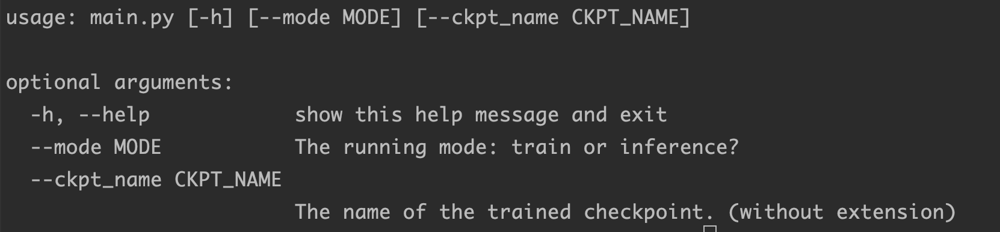
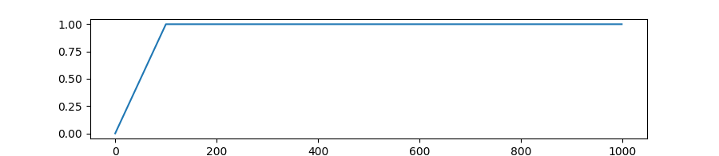

# ChatBot-GPT2笔记

记录一下项目开发中的理解，收获，思考🤔。[项目传送门](https://github.com/chenjunyi1999/ChatBot-Pytorch)

这里尽量按照项目文件结构逐一编写。


# GPT2模型

请在[chenjunyi1999/ML-Tutorial/模型笔记](https://github.com/chenjunyi1999/ML-Tutorial/tree/main/%E6%A8%A1%E5%9E%8B%E7%AC%94%E8%AE%B0)中查看笔记

也可以在[huggingface](https://huggingface.co/docs/transformers/model_doc/gpt2#transformers.TFGPT2LMHeadModel)官网查看模型细节


# main.py

`main.py` 是项目的模型主文件，获取命令行参数，初始化`tokenizer` ，`model`， `optimizer` 等，并根据参数完成模型训练和模型推理

## argparse

**argsparse**是python的命令行解析的标准模块，内置于python。使用这个模块可以很方便的在命令行下传入参数而不需要在代码的config 中修改。

```python
import argparse

parser = argparse.ArgumentParser()
parser.add_argument('--mode', default='train', type=str, required=False, help="The running mode: train or inference?")
parser.add_argument('--ckpt_name', type=str, required=False, help="The name of the trained checkpoint. (without extension)")
args = parser.parse_args()
```

可以使用 `python demo.py -h` 命令来查看传入参数的说明



得到的结果类似于python字典，可以用`args.参数名` 来提取这个参数

### 下面是一些常用参数的使用方法

- `nargs='+'` : nargs是用来说明传入的参数个数，'+' 表示传入至少一个参数
  `nargs='*' ` : 表示参数可设置零个或多个
  `nargs='?'` : 表示参数可设置零个或一个

  ```python
  parser = argparse.ArgumentParser(description='命令行中传入一个数字')
  parser.add_argument('integers', type=str,help='传入的数字')
  args = parser.parse_args()
  print(args.integers)
  >>> python main.py 1 2 3 4
  <<< error: unrecognized arguments: 2 3 4
      
  parser = argparse.ArgumentParser(description='命令行中传入一个数字')
  parser.add_argument('integers', type=str,nargs='+',help='传入的数字')
  args = parser.parse_args()
  print(args.integers)
  >>> python main.py 1 2 3 4
  <<< ['1', '2', '3', '4']
  ```

- `type` : 可以设置传入参数的数据类型，可以传入str,int,list, str, tuple, set, dict等

- `可选参数--` ：为了在命令行中避免上述位置参数传入错误（忘了顺序出错），可以使用可选参数，需要在关键词前面加`--`

  ```python
  parser = argparse.ArgumentParser()
  parser.add_argument('--mode', default='train', type=str, required=False, help="The running mode: train or inference?")
  parser.add_argument('--ckpt_name', type=str, required=False, help="The name of the trained checkpoint. (without extension)")
  args = parser.parse_args()
  
  >>> python main.py --mode="train" --ckpt_name="best"
  ```

- `default` ：默认值
- `required` : 必要值

## tokenizer

分词器的核心操作只有三个：tokenize, encode, decode。tokenize负责分词，encode将分词token转换成id，decode将id转换为文本。

项目里使用了一些之前不熟悉的 tokenizer 方法

**添加token** 

1. 通过add_tokens函数添加新token
2. 使用resize_token_embeddings函数通知模型更新词表大小

```python
num_added_toks = tokenizer.add_tokens(['new_tok1', 'my_new-tok2']) 
model.resize_token_embeddings(len(tokenizer))
```

**添加特殊token**

```python
#example1
special_tokens_dict = {'cls_token': '<CLS>'}
num_added_tokens = tokenizer.add_special_tokens(special_tokens_dict)
model.resize_token_embeddings(len(tokenizer))

#example2
special_tokens = {
    'bos_token': "<bos>",
    'additional_special_tokens': ["<sp1>", "<sp2>"],
}
num_new_tokens = tokenizer.add_special_tokens(special_tokens)
model.resize_token_embeddings(len(tokenizer))
```

与普通token唯一不同的是，添加特殊token的函数add_special_tokens需要提供的是字典，因为要指定是修改哪一个特殊项。第二步的resize_token_embeddings函数还是一样的。

**transformers **  有以下接口提供

```python
SPECIAL_TOKENS_ATTRIBUTES = [
 	 "bos_token",
   "eos_token",
   "unk_token",
   "sep_token",
   "pad_token",
   "cls_token",
   "mask_token",
   "additional_special_tokens",
]
```

## pin_mamory

**pin_memory** 就是锁页内存，创建DataLoader时，设置pin_memory=True，则意味着生成的Tensor数据最开始是属于内存中的锁页内存，**这样将内存的Tensor转到GPU的显存就会更快一些**。

主机中的内存，有两种存在方式，一是锁页，二是不锁页，锁页内存存放的内容在任何情况下都不会与主机的虚拟内存进行交换（注：虚拟内存就是硬盘），而不锁页内存在主机内存不足时，数据会存放在虚拟内存中

## get_polynomial_decay_schedule_with_warmup

使用schduler的作用是：在训练初期使用较小的学习率（从 0 开始），在一定步数（比如 1000 步）内逐渐提高到正常大小（比如0.001），避免模型过早进入局部最优而过拟合；在训练后期再慢慢将学习率降低到 0，避免后期训练还出现较大的参数变化

```python
from transformers import GPT2Tokenizer, GPT2LMHeadModel, get_polynomial_decay_schedule_with_warmup

# 优化器初始化
optim = torch.optim.AdamW(model.parameters(), lr=config['lr'])
# 计算总的step数
num_batches = len(train_loader)
total_train_steps = num_batches*config['num_epochs']
warmup_steps = int(0.1* total_train_steps)
# 初始化schedule
sched = get_polynomial_decay_schedule_with_warmup(optim,
                                                  num_warmup_steps=warmup_steps,
                                                  num_training_steps=total_train_steps,
                                                  power=2
                                                 )
```

- **get_constant_schedule**: 保持固定学习率不变
- **get_constant_schedule_with_warmup**: 在每一个 step 中线性调整学习率
  
- **get_linear_schedule_with_warmup**: 两段式调整学习率
  
- **get_cosine_schedule_with_warmup**：和两段式调整类似，只不过采用的是三角函数式的曲线调整
  
- **get_cosine_with_hard_restarts_schedule_with_warmup**：训练中将上面get_cosine_schedule_with_warmup 的调整重复 n 次
  
- **get_polynomial_decay_schedule_with_warmup**: 按指数曲线进行两段式调整

## SummaryWriter

用与tensorboard绘图

```python
from torch.utils.tensorboard import SummaryWriter

writer = SummaryWriter()

writer.add_scalar("Loss/train", train_loss, epoch)
writer.add_scalar("PPL/train", train_ppl, epoch)
writer.add_scalar("Loss/valid", valid_loss, epoch)
writer.add_scalar("PPL/valid", valid_ppl, epoch)
writer.add_scalars("Losses", {
  'train': train_loss,
  'valid': valid_loss,
}, epoch)
writer.add_scalars("PPLs", {
  'train': train_ppl,
  'valid': valid_ppl,
}, epoch)
```


# trainer.py

`trainer`没有设么特别的，主要是训练和验证类的代码。这个项目与常规`trainer`比没传入`criterion`参数是因为`huggingface-gpt2`模型自带`loss`

详细的可以参考[优雅的trainer](https://zhuanlan.zhihu.com/p/414843341) 的前半部分 或者 使用 `Pytorch-lighting`

## tqdm

**tqdm**是一个快速，可扩展的Python进度条，可以在 Python 长循环中添加一个进度提示信息，用户只需要封装任意的迭代器 tqdm(iterator)。

```python
for i, batch in enumerate(tqdm(self.train_loader)):
```

## 模型训练老三样 🤖️

模型一般训练一定要有三个步骤

0. 清空梯度

1. 计算loss

2. 反向传播backward

3. step

   ```python
   loss, logits= outputs[0], outputs[1]
   self.optim.zero_grad()
   loss.backward()
   self.optim.step()
   self.sched.step()
   ```

## 困惑度

困惑度 ppl  = exp {loss} 

## .train()和.eval()

model.train( ) ：启用 BatchNormalization 和 Dropout

model.eval( ) ：不启用 BatchNormalization 和 Dropout

```python
# 在训练时我们使用
self.model.train()
for i, batch in enumerate(tqdm(self.train_loader)):

# 在验证和最终交互时使用
self.model.eval()	
with torch.no_grad():
    for i, batch in enumerate(tqdm(self.valid_loader)):
```


# predictor.py

## infer代码注释

```python
def infer(self):
  	print("Let's start!")
  	print(f"If you want to quit the conversation, please type \"{config['end_command']}\".")

  	self.model.eval()
  	seed_everything(config['seed'])

  	with torch.no_grad():
        input_hists = []
        # 用户是speaker1 模型是speaker2
        while True:
            utter = input("You: ")
            # 如果是“Abort!” 那么就结束
            if utter == config['end_command']:
                print("Bot: Good bye.")
                break
            # 将用户说的话前面加上sp1_id 之后放入对话历史input_hists(ids格式)
            input_ids = [self.sp1_id] + self.tokenizer.encode(utter)
            input_hists.append(input_ids)

            # 如过对话历史input_hists超过 最大轮次config['max_turns']了，从前面截断
            if len(input_hists) >= config['max_turns']:
                num_exceeded = len(input_hists) - config['max_turns']+1
                input_hists = input_hists[num_exceeded:]

            # 把input_hists铺平，前面加上bos_id，后面在加上sp2_id(因为每一次循环经过到这边的时候最后一句话一定是sp1说的)
            input_ids = [self.bos_id] + list(chain.from_iterable(input_hists)) + [self.sp2_id]
            # input_hists最开始的话是谁说的 ->为了下面生成token_type_ids
            start_sp_id = input_hists[0][0]
            # input_hists之后的话是谁说的 ->为了下面生成token_type_ids
            next_sp_id = self.sp1_id if start_sp_id == self.sp2_id else self.sp2_id
            token_type_ids = [[start_sp_id] * len(hist) if h % 2 == 0 else [next_sp_id] * len(hist) for h, hist in enumerate(input_hists)]
            assert len(token_type_ids) == len(input_hists)
            # 这里与上面这几话对应起来了 bos也属于start_sp_id
            # input_ids = [self.bos_id] + list(chain.from_iterable(input_hists)) + [self.sp2_id]
            token_type_ids = [start_sp_id] + list(chain.from_iterable(token_type_ids)) + [self.sp2_id]
            assert len(input_ids) == len(token_type_ids)
            input_len = len(input_ids)

            #unsqueeze:扩充数据维度，在0起的指定位置N加上维数为1的维度
            #squeeze: 维度压缩，在0起的指定位置N，去掉维数为1的的维度
            # 这里增加batch_size这一维度
            input_ids = torch.LongTensor(input_ids).unsqueeze(0).to(config['device'])
            token_type_ids = torch.LongTensor(token_type_ids).unsqueeze(0).to(config['device'])
            output_ids = self.nucleus_sampling(input_ids, token_type_ids, input_len)
            res = self.tokenizer.decode(output_ids, skip_special_tokens=True)
            print(f"Bot: {res}")
            input_hists.append([self.sp2_id] + self.tokenizer.encode(res))
```

## nucleus_sampling代码注释

**Beam Search**

在当前级别的状态下计算所有可能性，并按照递增顺序对他们进行排序，但只保留一定数量的可能结果（依据**Beam Width**决定数量），接着根据这些可能结果进行扩展，迭代以上的动作直到搜索结束并返回最佳解（具有最高概率的那个）。
假设词表大小为3，包含[A, B, C]，Beam Width为2

1. 生成第1个词的时候，对P(A)、P(B)、P(C)进行排序，选取概率最大的两个，假设为A，C
2. 生成第2个词的时候，将当前序列A，C分别和词表中的所有词进行组合，得到新的6个序列为AA、AB、AC，CA、CB、CC，然后同样取概率最大的两个作为当前序列，假设为AA、CC
3. 重复以上的过程，直到遇到结束符为止，最终输出2个得分最高的序列

**Top-k Sampling**

在解码的每个时间步从前k个概率最大的词中按它们的概率进行采样。

问题：top-k sampling中k的选择是个难题，选大了可能会采样出长尾词，导致语句不通顺，选小了又退化成了Beam Search

**numcleus_sampleing**  

是 beam_search 的升级版！！Beam Search会总会选择最符合语言模型的词汇，因此生成的文本没有新意(less surprising)。之后提出了一种top-k sampling的改进方案来解决问题：nucleus sampling (top-p sampling)

给定一个概率阈值p，从解码词候选集中选择一个最小集Vp，使得它们出现的概率和大于等于p。然后再对Vp做一次re-scaling，本时间步仅从Vp集合中解码

```python
def nucleus_sampling(self, input_ids, token_type_ids, input_len):
    output_ids = []
    for pos in range(input_len, config['max_len']):
        # 没提供label,logits为第一个,形状[batch_size,seq_len,V]
      	# tensor([[ 2.,  5.,  3.,  4.,  1., 10.]])
        output = self.model(input_ids=input_ids, token_type_ids=token_type_ids)[0][:, pos - 1]  # (1, V)
        #tensor([[3.3195e-04, 6.6674e-03, 9.0233e-04, 2.4528e-03, 1.2212e-04, 9.8952e-01]])
        output = F.softmax(output, dim=-1)  # (1, V)
				#降序排序
        # tensor([[9.8952e-01, 6.6674e-03, 2.4528e-03, 9.0233e-04, 3.3195e-04, 1.2212e-04]])
        # tensor([[5, 1, 3, 2, 0, 4]])
        sorted_probs, sorted_idxs = torch.sort(output, descending=True)
        # tensor([[0.9895, 0.9962, 0.9986, 0.9995, 0.9999, 1.0000]])
        cumsum_probs = torch.cumsum(sorted_probs, dim=-1)  # (1, V)
        # 假设top_p是0.9995
        # tensor([[False, False, False,  True,  True,  True]])
        idx_remove = cumsum_probs > config['top_p']
        idx_remove[:, 1:] = idx_remove[:, :-1].clone()
        # tensor([[False, False, False, False,  True,  True]])
        idx_remove[:, 0] = False
        # tensor([[9.8952e-01, 6.6674e-03, 2.4528e-03, 9.0233e-04, 0.0000e+00, 0.0000e+00]])
        sorted_probs[idx_remove] = 0.0
        # tensor([[9.8997e-01, 6.6704e-03, 2.4539e-03, 9.0274e-04, 0.0000e+00, 0.0000e+00]])
        sorted_probs /= torch.sum(sorted_probs, dim=-1, keepdim=True)  # (1, V)
				# 放回原来的位置
        # tensor([[0.0000e+00, 6.6704e-03, 9.0274e-04, 2.4539e-03, 0.0000e+00, 9.8997e-01]])
        probs = torch.zeros(output.shape, device=config['device']).scatter_(-1, sorted_idxs, sorted_probs)  # (1, V)
        # 采样一个 tensor([[5]])
        idx = torch.multinomial(probs, 1)  # (1, 1)
				# 5
        idx_item = idx.squeeze(-1).squeeze(-1).item()
        output_ids.append(idx_item)

        if idx_item == self.eos_id:
            break
				# 自回归
        input_ids = torch.cat((input_ids, idx), dim=-1)
        next_type_id = torch.LongTensor([[self.sp2_id]]).to(config['device'])
        token_type_ids = torch.cat((token_type_ids, next_type_id), dim=-1)
        assert input_ids.shape == token_type_ids.shape

    return output_ids
```

几个之前遇到比较少的函数

1. **torch.multinomial(input, num_samples, replacement=False, out=None)**

   作用是对input的每一行做n_samples次取值，输出的张量是每一次取值时input张量对应行的**下标**

   `input (Tensor)` – the input tensor containing probabilities
   `num_samples (int)` – number of samples to draw
   `replacement (bool, optional)`  – whether to draw with replacement or not
   `out (Tensor, optional) ` – the output tensor

2. **scatter_(input, dim, index, src)**
   将src中数据根据index中的索引按照dim的方向填进input中

   

# process_data.py

分别定义加载四个数据集的方法

四个数据集：blended_skill_talk，persona_chat，empathetic，daily

|     数据集名称     | 训练集长度 | 验证集长度 | 测试集长度 |
| :----------------: | :--------: | :--------: | :--------: |
|       Daily        |   11118    |    1000    |    1000    |
|     empathetic     |   76673    |   12030    |   10943    |
|    persona_chat    |   17878    |    1000    |     -      |
| blended_skill_talk |    4819    |    4819    |    980     |

**GPT2 tokenizer** : gpt2 tokenizer 和 bert tokenizer不同，有一些细节，可以参考 [关于GPT2Tokenizer的一些发现](https://blog.csdn.net/qq_34418352/article/details/106627193)

**process_token_list** : [雨哥为这个项目写的注释](https://github.com/qitianyuu/nlp_ChatRobot/blob/main/src/process_data.py)

**四个数据集各式不同，处理起来要耐心仔细**

# mydataset.py

## CustomDataset代码注释

**torch.nn.CrossEntropyLoss(weight=None, size_average=None,ignore_index=-100, reduce=None, reduction=‘mean’)**

`weight`：不必多说，这就是各class的权重。
`reduction`：结果的规约方式，取值空间为{'mean', 'none', 'sum}。由于你传入 nn.CrossEntropyLoss()的输入是一个batch，那么按理说得到的交叉熵损失应该是 batch个loss。当前默认的处理方式是，对 batch 个损失取平均；也可以选择不做规约；或者将batch个损失取加和;
`ignore_index` ：做交叉熵计算时，若输入为ignore_index指定的数值，则该数值会被忽略，不参与交叉熵计算

```python
class CustomDataset(Dataset):
    def __init__(self, prefix, config):
        # 健壮性检查
        assert prefix == config['train_prefix'] or prefix == config['valid_prefix']

        print(f"Loading {prefix}_id.json.")
        with open(f"{config['data_dir']}/{prefix}_ids.json", 'r') as f:
            dials = json.load(f)

        self.input_ids = []        
        self.token_type_ids = []   
        self.labels = []           
				
        for dial in tqdm(dials):
            hists = []
            # 对每一句话循环，加上对话者ID，加入hists
            for u, utter in enumerate(dial):
                if u % 2 == 0:
                    hists.append([config['sp1_id']] + utter)
                else:
                    hists.append([config['sp2_id']] + utter)
						# 对于每句话循环
            for h in range(len(hists)):
              	# 如果是 <speaker2>，固定住h，从0开始往h找
                if hists[h][0] == config['sp2_id']:
                    start = max(0, h - config['max_turns'] + 1)
                    for s in range(start, h):
                        # 对话
                        contexts = hists[s:h + 1]
                        # 选出对话轮数合适的数据 大于2句，小于5句，因为上面循环的设置，会优先5句子
                        #if len(contexts) > config['max_turns']:
                        #    num_exceeded = len(contexts) - config['max_turns']
                        #    contexts = contexts[num_exceeded:]
                        if len(contexts) < 2:
                            break
                        # 加上特殊占位符bos和eos
                        input_ids = [config['bos_id']] + list(chain.from_iterable(contexts)) + [config['eos_id']]

                        if len(input_ids) <= config['max_len']:
                            # 为 input_ids 的每个位置标注上是谁说的话, 同时加上开始标志和下个speaker的开始标志
                            start_sp_id, next_sp_id = contexts[0][0], contexts[1][0]
                            # 生成token_type_ids
                            token_type_ids = [[start_sp_id] * len(ctx) if c % 2 == 0 else [next_sp_id] * len(ctx) for c, ctx in enumerate(contexts)] 
                            # 判断一下 最有一句话应该是spkear2（也就是模型）说的
                            assert token_type_ids[-1][0] == config['sp2_id']
                            # start_sp_id给input_ids里的bos_id  config['sp2_id']给input里的eos_id  
                            token_type_ids = [start_sp_id] + list(chain.from_iterable(token_type_ids)) + [config['sp2_id']]
                            # 检查两者长度相等
                            assert len(input_ids) == len(token_type_ids)
                            # 除了最后一句话，其他全部标注为 -100（最后一句话的sp2_id也是-100）
                            labels = [[-100] * len(ctx) if c < len(contexts) - 1 else [-100] + ctx[1:] for c, ctx in enumerate(contexts)]
                            assert labels[-1][1:] == contexts[-1][1:]
                            # bos -100  eos要计算损失
                            labels = [-100] + list(chain.from_iterable(labels)) + [config['eos_id']]
                            assert len(input_ids) == len(labels)
                            self.input_ids.append(input_ids)
                            self.token_type_ids.append(token_type_ids)
                            self.labels.append(labels)
                             # 当找到一个满足的对话，即跳出循环，寻找下一个满足的对话
                            break

    def __getitem__(self, idx):
        return self.input_ids[idx], self.token_type_ids[idx], self.labels[idx]

    def __len__(self):
        return len(self.input_ids)
```

## PadCollate注释

**torch.nn.utils.rnn.pad_sequence(sequences, batch_first=False, padding_value=0)**

这是pad操作，sequences也是list。`torch.nn.utils.rnn.pad_sequence`给list里的tensor都用padding_value来pad成最长的长度，并组合成一个tensor。

- **sequences** (*list*) – list of variable length sequences.
- **batch_first** (*bool*, *optional*) – output will be in `B x T x *` if True, or in `T x B x *` otherwise.  where T is the length of the longest
- **padding_value** (*float*,*optional*) – value for padded elements. Default: 0.

```python
class PadCollate():
    def __init__(self, eos_id):
        self.eos_id = eos_id

    def pad_collate(self, batch):
        input_ids, token_type_ids, labels = [], [], []
        for idx, seqs in enumerate(batch):
            input_ids.append(torch.LongTensor(seqs[0]))
            token_type_ids.append(torch.LongTensor(seqs[0]))
            labels.append(torch.LongTensor(seqs[2]))

        input_ids = torch.nn.utils.rnn.pad_sequence(input_ids, batch_first=True, padding_value=self.eos_id)
        token_type_ids = torch.nn.utils.rnn.pad_sequence(token_type_ids, batch_first=True, padding_value=self.eos_id)
        labels = torch.nn.utils.rnn.pad_sequence(labels, batch_first=True, padding_value=-100)

        return input_ids, token_type_ids, labels
```


# load_data.py

调用process_data.py 将四个不同的数据集合并保存为json形式

# utils.py

工具类，本项目工具函数只有一个 **seed_everything**

# settings.py

本项目所有的参数配置信息

```python
config = {
    'ckpt_dir': 'saved_models',
    'seed': 42,
    'device': 'cuda' if cuda.is_available() else 'cpu',
    'train_frac': 0.85,
    'data_dir': 'data',
    'model_name': 'gpt2',
    'train_prefix': 'train',
    'valid_prefix': 'valid',
    'max_turns': 5,
    'max_len': 1024,
    'lr': 2e-5,
    'batch_size': 8,
    'num_workers': 0,
    'num_epochs': 5,
    'warmup_ratio': 0.1,
    'bos_token': '<bos>',
    'sp1_token': '<sp1>',
    'sp2_token': '<sp2>',
    'end_command': 'Abort!',
    'top_p':0.8
}
```


# 学习资源

1. [devjwsong/gpt2-dialogue-generation-pytorch](https://github.com/devjwsong/gpt2-dialogue-generation-pytorch)

2. [🦄 How to build a State-of-the-Art Conversational AI with Transfer Learning](https://medium.com/huggingface/how-to-build-a-state-of-the-art-conversational-ai-with-transfer-learning-2d818ac26313)

3. [huggingface/transfer-learning-conv-ai](https://github.com/huggingface/transfer-learning-conv-ai)


