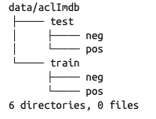
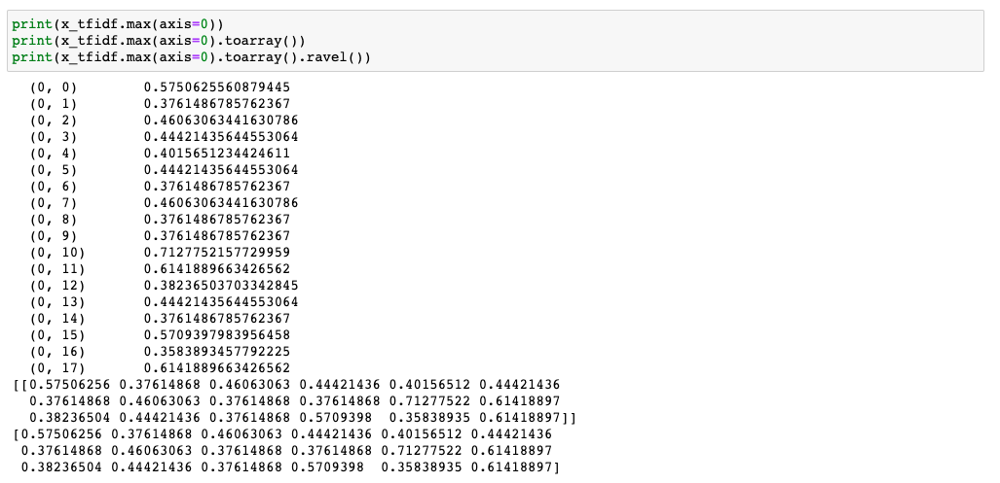
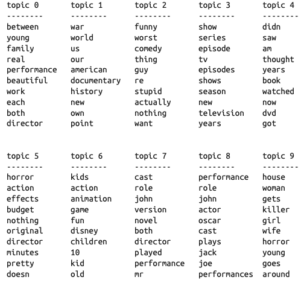
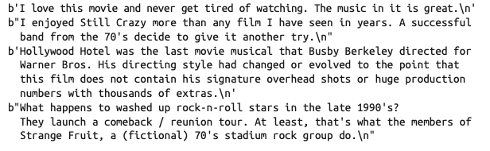

# 处理文本数据

数据集通 常被称为语料库(corpus)，每个由单个文本表示的数据点被称为文档(document)。

### 示例应用：电影评论的情感分析



将数据解压之后，数据集包括两个独立文件夹中的文本文件，一个是训练数据，一个是测试数据。每个文件夹又都有两个子文件夹，一个叫作 pos，一个叫作 neg

scikit-learn 中有一个辅助函数可以加载用这种文件夹结构保存的文件，其中每个子 文件夹对应于一个标签，这个函数叫作 **load\_files**

```python
from sklearn.datasets import load_files

reviews_train = load_files("data/aclImdb/train/")
# load_files返回一个Bunch对象，其中包含训练文本和训练标签 
text_train, y_train = reviews_train.data, reviews_train.target 
print("type of text_train: {}".format(type(text_train))) 
print("length of text_train: {}".format(len(text_train))) 
print("text_train[1]:\n{}".format(text_train[1])) 


'''
type of text_train: <class 'list'>
length of text_train: 25000
text_train[1]:b'Words can\'t describe how bad this movie is. I can\'t explain it by writing...
''' 
```

清洗数据，删除html格式

```python
text_train = [doc.replace(b"<br />", b" ") for doc in text_train]
```

之后用同样的方法载入测试集


### 将文本数据表示为词袋

用于机器学习的文本表示有一种最简单的方法，也是最有效且最常用的方法，就是使用**词袋(bag-of-words)**表示。舍弃了输入文本中的大部分结构，如章节、段落、句子和格式，只计算语料库中**每个单词在每个文本中的出现频次**。

**计算词袋三个步骤：**
（1）**分词(tokenization)。**将每个文档划分为出现在其中的单词 \[ 称为词例(token)]，比如 按空格和标点划分
（2）**构建词表(vocabulary building)。**收集一个词表，里面包含出现在任意文档中的所有词， 并对它们进行编号(比如按字母顺序排序)。
（3）**编码(encoding)**。对于每个文档，计算词表中每个单词在该文档中的出现频次。

词袋表示是在** CountVectorizer** 中实现的，它是一个变换器(transformer)。我们可以通过** vocabulary\_ **属性来访问词表。也可以通过**get\_feature\_name **方法，它将返回一个列表，每个元素对应于一个特征。

```python
from sklearn.feature_extraction.text import CountVectorizer
vect = CountVectorizer().fit(text_train) 
X_train = vect.transform(text_train) 

```

使用交叉验证的LogisticRegression先进行一个评估

```python
from sklearn.model_selection import cross_val_score
from sklearn.linear_model import LogisticRegression
scores = cross_val_score(LogisticRegression(), X_train, y_train, cv=5) 
print("Mean cross-validation accuracy: {:.2f}".format(np.mean(scores)))
```

得出平均分数为0.88。**这里对X\_train整体进行变换而不是使用piepline来避免在交叉验证中的泄漏是因为CountVectorizer的默认设置实际上不会收集任何统计信息**，所以结果是有效的。

寻找一个最佳的LogisticRegression正则化参数C

```python
from sklearn.model_selection import GridSearchCV
param_grid = {'C': [0.001, 0.01, 0.1, 1, 10]}
grid = GridSearchCV(LogisticRegression(), param_grid, cv=5) 
grid.fit(X_train, y_train)
print("Best cross-validation score: {:.2f}".format(grid.best_score_)) 
print("Best parameters: ", grid.best_params_) 
```

最佳参数为C=0.1，分数为0.89。之后在测试集上评估

```python
X_test = vect.transform(text_test) 
print("{:.2f}".format(grid.score(X_test, y_test)))

```

测试集上分数为0.8

**CountVectorizer默认使用的正则表达式是 "\b\w\w+\b"。可以用 min\_df 参数 来设置词例至少需要在多少个文档中出现过。**

```python
vect = CountVectorizer(min_df=5).fit(text_train) 
X_train = vect.transform(text_train)
grid = GridSearchCV(LogisticRegression(), param_grid, cv=5) 
grid.fit(X_train, y_train)
print("Best cross-validation score: {:.2f}".format(grid.best_score_))

```

最佳参数的分数还是0.89。并没有改进模型，但减少要处理 的特征数量可以加速处理过程，舍弃无用的特征也可能提高模型的可解释性


### 停用词

删除没有信息量的单词还有另一种方法，就是舍弃那些出现次数太多以至于没有信息量的单词。

有两种主要方法:使用特定语言的停用词(stopword)列表，或者舍弃那些出现过于频 繁的单词。scikit-learn 的 **feature\_extraction.text **模块中提供了英语停用词的内置列表。第二种方法通过设置 CountVectorizer 的 max\_df 选项来舍弃出现最频繁的单词

```python
from sklearn.feature_extraction.text import ENGLISH_STOP_WORDS 
print("Number of stop words: {}".format(len(ENGLISH_STOP_WORDS))) 
print("Every 10th stopword:\n{}".format(list(ENGLISH_STOP_WORDS)[::10]))
'''
Number of stop words: 318
Every 10th stopword:
['above', 'elsewhere', 'into', 'well', 'rather', 'fifteen', 'had', 'enough',
'herein', 'should', 'third', 'although', 'more', 'this', 'none', 'seemed',
'nobody', 'seems', 'he', 'also', 'fill', 'anyone', 'anything', 'me', 'the',
'yet', 'go', 'seeming', 'front', 'beforehand', 'forty', 'i']
''' 
# 指定stop_words="english"将使用内置列表。
# 我们也可以扩展这个列表并传入我们自己的列表。
vect = CountVectorizer(min_df=5, stop_words="english").fit(text_train) 
X_train = vect.transform(text_train)
print("X_train with stop words:\n{}".format(repr(X_train))) 
```

在电影评论这个数据集中，使用英文停用词列表特征数量减少了 305 个。

```python
grid = GridSearchCV(LogisticRegression(), param_grid, cv=5) grid.fit(X_train, y_train)
print("Best cross-validation score: {:.2f}".format(grid.best_score_))
'''
Best cross-validation score: 0.88
''' 
```

性能略有下降,不至于担心但是不值得。固定的列表主要对小型数据集很有帮助，这些数据集可能没有包含足够的信息，模型从数 据本身无法判断出哪些单词是停用词。


### 用tf-idf缩放数据

另一种方法是按照我们预计的特征信息量大小来缩放特征，而不是舍弃那些认为不重要的特征。最常见的一种做法就是使用**词频 - 逆向文档频率(term frequency–inverse document frequency，tf-idf)**方法

这一方法对在某个特定文档中经常出现的术语给予很高的权 重，但对在语料库的许多文档中都经常出现的术语给予的权重却不高。（如果一个单词在 某个特定文档中经常出现，但在许多文档中却不常出现，那么这个单词很可能是对文档内容的很好描述）

scikit-learn 在两个类中实现了 tf-idf 方法:**TfidfTransformer **和 **TfidfVectorizer**，前者接受 CountVectorizer 生成的稀疏矩阵并将其变换，后者接受文本 数据并完成词袋特征提取与 tf-idf 变换

其中单词w在文档d中的tf-idf分 数 在 TfidfTransformer 类和 TfidfVectorizer 类中都有实现，其计算公式如下所示：

$$
tfidf(w,d)=tf \log {\frac {N+1}{N_w+1} +1}
$$

其中 N 是训练集中的文档数量，Nw 是训练集中出现单词 w 的文档数量，tf(词频)是单词 w 在查询文档 d(你想要变换或编码的文档)中出现的次数。两个类在计算 tf-idf 表示之后都还应用了 L2 范数。换句话说，它们将每个文档的表示缩放到欧几里得范数为 1。利用这种缩放方法，文档长度(单词数量)不会改变向量化表示。

由于 tf-idf 实际上利用了训练数据的统计学属性，所以需要使用管道以确保网格搜索的有效性

```python
from sklearn.feature_extraction.text import TfidfVectorizer 
from sklearn.pipeline import make_pipeline
pipe = make_pipeline(TfidfVectorizer(min_df=5),LogisticRegression())
param_grid = {'logisticregression__C': [0.001, 0.01, 0.1, 1, 10]}
grid = GridSearchCV(pipe, param_grid, cv=5)
grid.fit(text_train, y_train)
print("Best cross-validation score: {:.2f}".format(grid.best_score_))

'''
Best cross-validation score: 0.89
''' 
```

可见性能有所提高，我们还可以查看 tf-idf 找到的最重要的单词。（这里“重要”与“正面评论”和“负面评论”无关）

```python
#先提取管道中的TfidfVectorizer
vectorizer = grid.best_estimator_.named_steps["tfidfvectorizer"]
#变换训练数集
X_train = vectorizer.transform(text_train) 
# 找到数据集中每个特征的最大值
max_value = X_train.max(axis=0).toarray().ravel()
sorted_by_tfidf = max_value.argsort()
# 获取特征名称
feature_names = np.array(vectorizer.get_feature_names())
print("Features with lowest tfidf:\n{}".format(feature_names[sorted_by_tfidf[:20]]))
print("Features with highest tfidf: \n{}".format( feature_names[sorted_by_tfidf[-20:]]))

'''
Features with lowest tfidf:
     ['poignant' 'disagree' 'instantly' 'importantly' 'lacked' 'occurred'
      'currently' 'altogether' 'nearby' 'undoubtedly' 'directs' 'fond' 'stinker'
      'avoided' 'emphasis' 'commented' 'disappoint' 'realizing' 'downhill'
      'inane']
Features with highest tfidf:
     ['coop' 'homer' 'dillinger' 'hackenstein' 'gadget' 'taker' 'macarthur'
     'vargas' 'jesse' 'basket' 'dominick' 'the' 'victor' 'bridget' 'victoria'
     'khouri' 'zizek' 'rob' 'timon' 'titanic']
'''

```



上图使用随便输入的玩具数据集进行操作展示结果，ravel() 可以对多维数据进行扁平化操作

还可以找到逆向文档频率较低的单词，即出现次数很多，因此被认为不那么重要的单词。**训练集的逆向文档频率值被保存在 idf\_ 属性中**

```python
sorted_by_idf = np.argsort(vectorizer.idf_)
print("Features with lowest idf:\n{}".format(feature_names[sorted_by_idf[:100]])) 
```

这些词大多是停用词"the","no"或影评特有"movie","film","time"。但同时"good"、"great" 和 "bad" 也属于频繁出现的单词，因此根据 tf-idf 度量也属于“不太相关”的单词，尽管我们 可能认为这些单词对情感分析任务非常重要


### 多个单词的词袋（n元分词）

使用词袋表示的主要缺点之一是完全舍弃了单词顺序。使用词袋表示时有一种获取上 下文的方法，就是不仅考虑单一词例的计数，而且还考虑相邻的两个或三个词例的计数。两个词例被称为二元分词(bigram)，三个词例被称为三元分词(trigram)，更一般的词例 序列被称为 n 元分词(n-gram)。

我们可以通过改变 CountVectorizer 或 TfidfVectorizer 的 ngram\_range 参数来改变作为特征的词例范围。ngram\_range 参数是一个元组，包含要考 虑的词例序列的最小长度和最大长度。默认情况下，为每个长度最小为 1 且最大为 1 的词例序列(或者换句话说，刚好 1 个词 例)创建一个特征——单个词例也被称为一元分词(unigram)

要想仅查看二元分词(即仅查看由两个相邻词例组成的序列)，可以将 ngram\_range 设置为 (2, 2)

```python
cv = CountVectorizer(ngram_range=(2, 2)).fit(bards_words) 

```

对于大多数应用而言，最小的词例数量应该是 1，因为单个单词通常包含丰富的含义。在 大多数情况下，添加二元分词会有所帮助。添加更长的序列(一直到五元分词)也可能有 所帮助，但这会导致特征数量的大大增加，也可能会导致过拟合，因为其中包含许多非常 具体的特征。

下面是在 bards\_words 上使用一元分词、二元分词和三元分词

```python
cv = CountVectorizer(ngram_range=(1, 3)).fit(bards_words)
```

在 IMDb 电影评论数据上尝试使用 TfidfVectorizer，并利用网格搜索找出 n 元分词的最佳设置

```python
pipe = make_pipeline(TfidfVectorizer(min_df=5), LogisticRegression()) 
# 运行网格搜索需要很长时间，因为网格相对较大，且包含三元分词 
param_grid = {"logisticregression__C": [0.001, 0.01, 0.1, 1, 10, 100],
              "tfidfvectorizer__ngram_range": [(1, 1), (1, 2), (1, 3)]}
grid = GridSearchCV(pipe, param_grid, cv=5)
grid.fit(text_train, y_train)
print("Best cross-validation score: {:.2f}".format(grid.best_score_)) 
print("Best parameters:\n{}".format(grid.best_params_))

'''
Best cross-validation score: 0.91
Best parameters:
{'tfidfvectorizer__ngram_range': (1, 3), 'logisticregression__C': 100}
''' 
```


### 高级分词、词干提取与词形还原

将一个词的单复数，或动词的不同形式同时包含在词袋中，可能会造成过拟合，并导致模型无法充分利用训练数据。不利于泛化。

这个问题可以通过用**词干(word stem)**表示每个单词来解决，这一方法涉及找出 \[ 或合并 (conflate)] 所有具有相同词干的单词。
\- 如果使用基于规则的启发法来实现(比如删除常见的后缀)，那么通常将其称为**词干提取(stemming)。**【nltk包的Porter词干提取器】
\- 如果使用的是由已知单词形式组成的 字典(明确的且经过人工验证的系统)，并且考虑了单词在句子中的 作用，那么这个过程被称为**词形还原(lemmatization)**。【spacy包】
\- 单词的标准化形式被称为**词元(lemma)**。

词干提取和词形还原这两种处理方法都是**标准化(normalization)**的形式之一，标准化是指尝试提取 一个单词的某种标准形式。标准化的另一个有趣的例子是拼写校正

```python
import spacy
import nltk
# 加载spacy的英语模型
en_nlp = spacy.load('en')
# 将nltk的Porter词干提取器实例化 
stemmer = nltk.stem.PorterStemmer()

# 定义一个函数来对比spacy中的词形还原与nltk中的词干提取 
def compare_normalization(doc):
    # 在spacy中对文档进行分词
    doc_spacy = en_nlp(doc)
    # 打印出spacy找到的词元
    print("Lemmatization:")
    print([token.lemma_ for token in doc_spacy])
    # 打印出Porter词干提取器找到的词例
    print("Stemming:")
    print([stemmer.stem(token.norm_.lower()) for token in doc_spacy])


compare_normalization(u"Our meeting today was worse than yesterday, " "I'm scared of meeting the clients tomorrow.")

'''
Lemmatization:
['our', 'meeting', 'today', 'be', 'bad', 'than', 'yesterday', ',', 'i', 'be',
'scared', 'of', 'meet', 'the', 'client', 'tomorrow', '.']
Stemming:
['our', 'meet', 'today', 'wa', 'wors', 'than', 'yesterday', ',', 'i', "'m",
'scare', 'of', 'meet', 'the', 'client', 'tomorrow', '.']
''' 
```

词形还原是一个比词干提取更复杂的过程，但用于 机器学习的词例标准化时通常可以给出比词干提取更好的结果。

虽然 scikit-learn 没有实现这两种形式的标准化，但 CountVectorizer 允许使用 tokenizer 参数来指定使用你自己的分词器将每个文档转换为词例列表。我们可以使用 spacy 的词形 还原了创建一个可调用对象，它接受一个字符串并生成一个词元列表

```python
# 技术细节:我们希望使用由CountVectorizer所使用的基于正则表达式的分词器， 
# 并仅使用spacy的词形还原。
# 为此，我们将en_nlp.tokenizer(spacy分词器)替换为基于正则表达式的分词。 
import re
# 在CountVectorizer中使用的正则表达式 
regexp = re.compile('(?u)\\b\\w\\w+\\b')
# 加载spacy语言模型，并保存旧的分词器
en_nlp = spacy.load('en')
old_tokenizer = en_nlp.tokenizer
# 将分词器替换为前面的正则表达式
en_nlp.tokenizer = lambda string: old_tokenizer.tokens_from_list(regexp.findall(string))
# 用spacy文档处理管道创建一个自定义分词器 # (现在使用我们自己的分词器)
def custom_tokenizer(document):
    doc_spacy = en_nlp(document, entity=False, parse=False) 
    return [token.lemma_ for token in doc_spacy]
# 利用自定义分词器来定义一个计数向量器
lemma_vect = CountVectorizer(tokenizer=custom_tokenizer, min_df=5)

X_train_lemma = lemma_vect.fit_transform(text_train) 
print("X_train_lemma.shape: {}".format(X_train_lemma.shape)) 
'''
X_train_lemma.shape: (25000, 21596)
''' 
#对比
vect = CountVectorizer(min_df=5).fit(text_train) 
X_train = vect.transform(text_train) 
print("X_train.shape: {}".format(X_train.shape)) 
'''
X_train.shape: (25000, 27271)
''' 
```

词形还原与词干提取有时有助于构建更好的模型(或至少是更简洁的模 型)，所以我们建议你，在特定任务中努力提升最后一点性能时可以尝试下这些技术。


### 主题建模与文档聚类

常用于文本数据的一种特殊技术是主题建模(topic modeling)，这是描述将每个文档分配给一个或多个主题的任务(通常是无监督的)的概括性术语。

#### 隐含狄利克雷分布(Latent Dirichlet Allocation，LDA)

从直观上来看，LDA 模型试图找出频繁共同出现的单词群组(即主题)。LDA 还要求，每个文档可以被理解为主题子集的“混合”。

重要的是要理解，机器学习模型所谓的“主 题”可能不是我们通常在日常对话中所说的主题，而是更类似于 PCA 或 NMF(第 3 章 讨论过这些内容)所提取的成分，它可能具有语义，也可能没有。

将 LDA 应用于电影评论数据集，来看一下它在实践中的效果。(除至少在 15% 的文档中出现过的单词,将词袋模型限定为最常见的 10000 个 单词)

```python
vect = CountVectorizer(max_features=10000, max_df=.15) 
X = vect.fit_transform(text_train) 
```

我们将学习一个包含 10 个主题的主题模型，它包含的主题个数很少，我们可以查看所有主题。与 NMF 中的分量类似，主题没有内在的顺序，而改变主题数量将会改变所有主题。我们将使用 "batch" 学习方法，它比默认方法("online")稍慢，但通常会给出更好的结果。我们还将增大 max\_iter，这样会得到更好的模型

```python
from sklearn.decomposition import LatentDirichletAllocation
lda = LatentDirichletAllocation(n_topics=10, learning_method="batch",max_iter=25, random_state=0) # 我们在一个步骤中构建模型并变换数据
# 计算变换需要花点时间，二者同时进行可以节省时间 
document_topics = lda.fit_transform(X)

```

LatentDirichletAllocation 有一个 components\_ 属性， 其中保存了每个单词对每个主题的重要性。components\_ 的大小为 (n\_topics, n\_words) 这里为（10，10000）

查看每个主题中最重要的单词，用print\_topics函数

```python
# 对于每个主题(components_的一行)，将特征排序(升序) 
# 用[:, ::-1]将行反转，使排序变为降序
sorting = np.argsort(lda.components_, axis=1)[:, ::-1] 
# 从向量器中获取特征名称
feature_names = np.array(vect.get_feature_names())
#topics传入要看的topic的个数
mglearn.tools.print_topics(topics=range(10), feature_names=feature_names,
                           sorting=sorting, topics_per_chunk=5, n_words=10)

```



还可以划分为100个主题，并且按照某一主题将文档排序

```python
# 按主题45“music”进行排序
music = np.argsort(document_topics100[:, 45])[::-1] 
# 打印出这个主题最重要的前5个文档
for i in music[:10]:
    # 显示前两个句子 
    print(b".".join(text_train[i].split(b".")[:2]) + b".\n")
#下面是输出的一部分 
```


