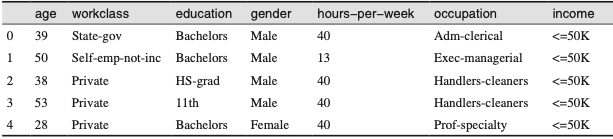
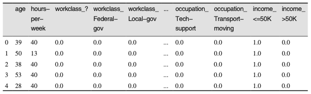

# 数据表示与特征工程

**连续特征 / 分类特征(离散特征)**

如何找到最佳的数据表示，这个问题被称为特征工程。用正确的方式表示数据，对监督模型性能的影响比所选择的精确参数还要大。

## 一、分类变量

### 1、one-hot编码（虚拟变量）

表示分类变量最常用的方法就是使用 one-hot 编码(one-hot-encoding)或 N 取一编码(one-out-of-N encoding)，也叫虚拟变量(dummy variable)。

举例子，workclass 的值包括 "Government Employee"、"Private Employee"、 "Self Employed"和"Self Employed Incorporated"，我们创建4个新特征。取某个值对应那个特征为1，其他为0

pandas编码数据方法：使用**get\_dummies**函数,函数自动变换所有具有对象类型(比如字符串)的列或所有分类的列





get\_dummies将除了连续特征外的其他特征，分类特征的每个取值都扩展为新的特征。（如果训练集和测试集在不同的数据框中，需要同时调用get\_dummies，并且需要确保训练集和测试集列名一致）

pandas列索引包括范围的结尾 ， 这与numpy数组切片不同，后者不包括结尾

注意要将目标变量从数据中分离出来

### 2、数字可以编码分类变量

分类特征通常用整数进行编码。它们是数字并不意味着它们必须被视为连续特征。\[例子：不同工作类型按照1、2、3、4 ... 8统计]

pandas 的 get\_dummies 函数将所有数字看作是连续的，不会为其创建虚拟变量。为了解决这个问题，你可以使用 scikit-learn 的 **OneHotEncoder**（目前只适用于值为整数的分类变量），指定哪些变量是连续的、哪些变量是离散的（或者将数值转换为字符串）。


## 二、分箱、离散化、线性模型与树

**分箱（binning，也叫离散化discretization）**：让线性模型在离散数据上变得更强大，但对决策树模型通常不会产生更好的效果。

对于特定的数据集，如果有充分的理由使用线性模型——比如数据集很大、维度很高，但有些特征与输出的关系是非线性的——那么分箱是提高建模能力的好方法。


## 三、交互特征与多项式特征

想要丰富特征表示，特别是对于线性模型而言，另一种方法是添加原始数据的**交互特征 (interaction feature)和多项式特征(polynomial feature)。**

在sklearn中preprocessing的**PolynomialFeatyures**实现(x\*\*2 x\*\*3 x\*\*4等)

```python
from sklearn.preprocessing import PolynomialFeatures
# 包含直到x ** 10的多项式:
# 默认的"include_bias=True"添加恒等于1的常数特征
poly = PolynomialFeatures(degree=10, include_bias=False)
ploy.fit(X)
X_ploy = ploy.tranmsform(X) 
#多项式的次数为10，因此生成了10个特征 
```

将多项式特征与线性回归模型一起使用，可以得到经典的多项式回归(polynomial regression)模型


## 四、单变量非线性变换

log 和 exp 函数可以帮 助调节数据的相对比例，从而改进线性模型或神经网络的学习效果。

sin 和 cos 函数在处理具有周期性模式的数据时非常有用。

对基于树的模型这种变换并不重要，但是对于线性模型来说至关重要。对回归的目标变量y进行变换有时候也是一个好主意


## 五、自动化特征选择

### 1、单变量统计

在单变量统计中，我们计算每个特征和目标值之间的关系是否存在统计显著性，然后选择具有最高置信度的特征。对于分类问题，这也被称为方差分析(analysis of variance， ANOVA)。这些测试的一个关键性质就是它们是单变量的(univariate)，即它们只单独考 虑每个特征。

完全独立于你后面想要应用的模型

在scikit-learn中使用单变量特征选择，需要选择一项测试，对分类问题通常 是** f\_classif**(默认值)，对回归问题通常是 **f\_regression**——然后基于测试中确定的 p 值来选择一种舍弃特征的方法。所有舍弃参数的方法都使用阈值来舍弃所有 p 值过大的特征(意味着它们不可能与目标值相关)。计算阈值的方法各有不同，最简单的是 **SelectKBest **和 **SelectPercentile**，前者选择固定数量的 k 个特征，后者选择固定百分比的特征。

### 2、基于模型的选择

使用一个监督机器学习模型来判断每个特征的重要性，并且保留最重要的特征。决策树和基 于决策树的模型提供了 feature\_importances\_ 属性，可以直接编码每个特征的重要性。线性模型系数的绝对值也可以用于表示特征重要性（类似于L1惩罚）。在sklearn中使用**SelectFromModel**变换器

单变量选择不同， 基于模型的选择同时考虑所有特征，因此可以获取交互项(如果模型能够获取它们的话)

```python
from sklearn.feature_selection import SelectFromModel 
from sklearn.ensemble import RandomForestClassifier 
select = SelectFromModel(RandomForestClassifier(n_estimators=100, random_state=42), threshold="median")
select.fit(X_train, y_train)
X_train_l1 = select.transform(X_train) 
```

### 3、迭代选择

构建一系列模型，每个模型都使用不同数量的特征。有两种基本方法:开始时没有特征，然后逐个添加特征，直到满足某个终止条件;或者从所有特征开始，然后逐个删除特征，直到满足某个终止条件。由于构建了一系列模型，所以这些方法的计算成本要比前面讨论过的方法更高。

其中一个特殊方法是 **递归特征消除(recursive feature elimination，RFE)**，它从所有特征开始构建模型，并根据模型舍弃最不重要的特征，然后使用除被舍弃特征之外的所有特征来构建一个新模型，如此继续，直到仅 剩下预设数量的特征。

```python
from sklearn.feature_selection import RFE
select = RFE(RandomForestClassifier(n_estimators=100, random_state=42),n_features_to_select=40) 
select.fit(X_train, y_train) 
```

运行时间很长，因为没运行一次值删除一个特征


## 六、利用专家知识

略
