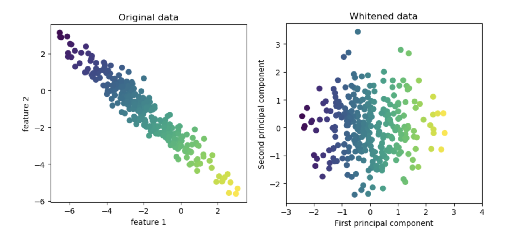
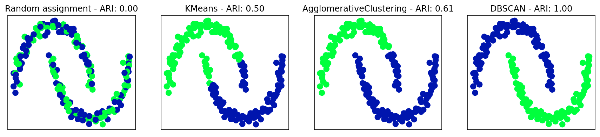

# 无监督学习

学习算法只有输入数据，并需要从这些数据中提取知识。

无监督学习的问题分两种：**数据集变换**与**聚类**

**无监督变换**是创建数据新的表示算法，常见的应用是**降维**（通常为了可视化）、**找数据的组成部分**（如对文本进行主题提取）
**聚类算法**将数据分成不同组


#### 预处理和缩放


预处理和缩放通常与监督学习算法一起使用，但缩放方法并没有用到与“监督”有关的信息，所以它是无监督的。


## 降维、特征提取与流形学习

最常见的目的就是可视化、压缩数据，以及寻找信息量更大的数据表示以用于进一步的处理。一般来说：
主成分分析：提取特征
非负矩阵分界（NMF）和t-SNE：二维散点图的可视化

### 一、主成分分析PCA

**主成分分析(principal component analysis，PCA)**是一种旋转数据集的方法，旋转后的特征在统计上不相关。在昨晚这种旋转之后，通常是根据新特征对解释数据的重要性来选择它的一个子集。可用于可视化和特征提取。

#### 1、PCA应用于cancer数据集并可视化

```python
from sklearn.decomposition import PCA 
# 保留数据的前两个主成分
pca = PCA(n_components=2)
# 对乳腺癌数据拟合PCA模型 
pca.fit(X_scaled)
# 将数据变换到前两个主成分的方向上
X_pca = pca.transform(X_scaled)
print("Original shape: {}".format(str(X_scaled.shape))) 
print("Reduced shape: {}".format(str(X_pca.shape)))

'''
output:
     Original shape: (569, 30)
     Reduced shape: (569, 2)
'''

```

PCA 的一个缺点在于，通常不容易对图中的两个轴做出解释。主成分对应于原始数据中的 方向，所以它们是原始特征的组合。但这些组合往往非常复杂。

#### 2、特征提取的特征脸

这里我们启用 PCA 的白化(whitening)选项，它将主成分缩放到相同的尺 度。变换后的结果与使用 StandardScaler 相同。



```python
pca = PCA(n_components=100, whiten=True, random_state=0)
pca.fit(X_train) 
X_train_pca = pca.transform(X_train)
X_test_pca = pca.transform(X_test)
'''
新数据有100个主成分
现在可以单一近邻分类器再试一次（准确率0.266-->0.357）
''' 
```

### 二、非负矩阵分解NMF

**非负矩阵分解(non-negative matrix factorization，NMF)**是另一种无监督学习算法，其目的在于提取有用的特征。它的工作原理类似于 PCA，也可以用于降维。与 PCA 相同，我们试图将每个数据点写成一些分量的加权求和。但在 PCA 中，我们想 的是正交分量，并且能够解释尽可能多的数据方差; **而在 NMF 中，我们希望分量和系数均为非负，也就是说，我们希望分量和系数都大于或等于 0**。**因此，这种方法只能应用于每个特征都是非负的数据，因为非负分量的非负求和不可能变为负值**。

**对由多个独立源相加(或叠加)创建而成的数据特别有用**，比如多人说话的音轨或包含多种乐器的音乐。

NMF的分量更容易解释

### 三、t-SNE

t-SNE 背后的思想是找到数据的 一个二维表示，尽可能地保持数据点之间的距离。t-SNE 首先给出每个数据点的随机二维表示，然后尝试让在原始特征空间中距离较近的点更加靠近，原始特征空间中相距较远的 点更加远离。

t-SNE 不支持变换新数据， 所以 TSNE 类没有** transform **方法。我们可以调用 **fit\_transform **方法来代替，它会构建模型并立刻返回变换后的数据

```python
from sklearn.manifold import TSNE
tsne = TSNE(random_state=42)
# 使用fit_transform而不是fit，因为TSNE没有transform方法 
digits_tsne = tsne.fit_transform(digits.data)
```


## 聚类

聚类(clustering)是将数据集划分成组的任务，这些组叫作簇(cluster)。聚类算法为每个数据点分配(或预测)一个数字，表示这个点属于哪个簇。

### 一、k均值聚类

k 均值聚类是最简单也最常用的聚类算法之一。它试图找到代表数据特定区域的簇中心 (cluster center)。算法交替执行以下两个步骤:将每个数据点分配给最近的簇中心，然后将 每个簇中心设置为所分配的所有数据点的平均值。如果簇的分配不再发生变化，那么算法结束。

k均值聚类速度快，简单。可以处理大量的数据。但是算法依赖于随机初始化（一般重复多次取最好的一次）且对簇形状的假设的约束性较强。

### 二、凝聚聚类

凝聚聚类(agglomerative clustering)指的是许多基于相同原则构建的聚类算法，这一原则 是:算法首先声明每个点是自己的簇，然后合并两个最相似的簇，直到满足某种停止准则为止。

scikit-learn中关于如何规定“最相似的簇”：

ward  ：默认选项。ward 挑选两个簇来合并，使得所有簇中的方差增加最小。这通常会得到大 小差不多相等的簇。
average  ：average 链接将簇中所有点之间平均距离最小的两个簇合并。
complete  ：complete 链接(也称为最大链接)将簇中点之间最大距离最小的两个簇合并。

### 三、DBSCAN

DBSCAN(density-based spatial clustering of applications withnoise，即“具有噪声的基于密度的空间聚类应用”）。DBSCAN 的原理是识别特征空间的“拥挤”区域中的点，在这些区域中许多数据点靠近在 一起。这些区域被称为特征空间中的密集(dense)区域。DBSCAN 背后的思想是，簇形成数据的密集区域，并由相对较空的区域分隔开。在密集区域内的点被称为核心样本(core sample，或核心点)，它们的定义如下。DBSCAN 有两个参数:**min\_samples 和 eps**。如果在距一个给定数据点 eps 的距离内至少有 min\_ samples 个数据点，那么这个数据点就是核心样本。DBSCAN 将彼此距离小于 eps 的核心 样本放到同一个簇中。

算法首先任意选取一个点，然后找到到这个点的距离小于等于 eps 的所有的点。如果距起始点的距离在 eps 之内的数据点个数小于 min\_samples，那么这个点被标记为噪声(noise)，也就是说它不属于任何簇。如果距离在 eps 之内的数据点个数大于 min\_ samples，则这个点被标记为核心样本，并被分配一个新的簇标签。然后访问该点的所有邻居(在距离 eps 以内)。如果它们还没有被分配一个簇，那么就将刚刚创建的新的簇标 签分配给它们。如果它们是核心样本，那么就依次访问其邻居，以此类推。簇逐渐增大， 直到在簇的 eps 距离内没有更多的核心样本为止。然后选取另一个尚未被访问过的点， 并重复相同的过程。

一共有三种类型的点:核心点、与核心点的距离在 eps 之内的点(叫作边界点，boundary point)和噪声。一般来说只有很少的边界点，这种 对访问顺序的轻度依赖并不重要

优点：不需要用户先验地设置簇的个数、可以划分具有复杂形状的簇、可以找出不属于任何簇的点
缺点：相比速度较慢

### 四、聚类算法的比较和评估

**1、用真实值评估聚类**

有一些指标可用于评估聚类算法相对于真实聚类的结果，其中最重要的是**调整 rand 指数 (adjusted rand index，ARI)和归一化互信息(normalized mutual information，NMI)**，二者都给出了定量的度量，其最佳值为 1，0 表示不相关的聚类(虽然 ARI 可以取负值)

（1）用ARI来比较

**adjusted\_rand\_ score**



用这种方法的一个常见错误是使用accuracy\_score而不是adjusted\_rand\_ score或其他聚类指标。使用精度的问题在于，它要求分 配的簇标签与真实值完全匹配。但簇标签本身毫无意义——唯一重要的是哪些点位于同一 个簇中。

（2）用NMI

**ormalized\_mutual\_info\_score**

**2、在没有真实值的情况下评估聚类**

**轮廓系数(silhouette coeffcient)**：轮廓分数计算一个簇的紧致度，值越大越好最高为1。实践中的效果不好，不允许复杂的情况 ** silhouette\_score**

更好的策略是使用 **基于鲁棒性的(robustness-based)聚类指标**。这种指标现象数据中添加一些噪声，或者使用不同的参数设定，然后运行算法，并对结果进行比较。其思想 是，如果许多算法参数和许多数据扰动返回相同的结果，那么它很可能是可信的。不幸的 是，目前scikit-learn 还没有实现这一策略。

如果要对某一特定的方面聚类（男人/女人 有胡子/没胡子 正面/侧面）算法只能返回相同的聚类结果。需要对算法人工分析
