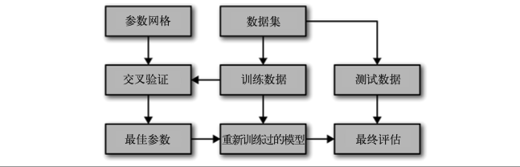
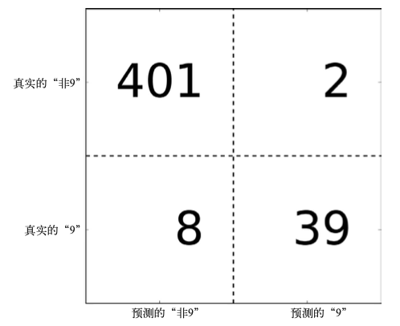
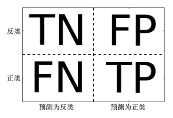
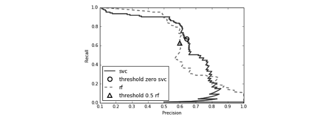
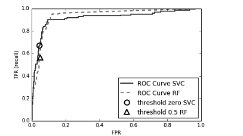

# 模型评估和改进

## 一、交叉验证

数据被多次划分，并且需要训练多个模型。最常见的交叉验证是**k折交叉验证(k-fold cross-validation)**，k由用户决定，通常为5或10。数据被划分为大致相等的k份，每一部分为一**折（fold）**。用一折作为测试集，其他作为训练集分别训练k个模型，得到k个精度。

scikit-learn利用model\_selection中的**cross\_val\_score**函数来实现交叉验证。**cross\_val\_score** 函数的参数是我们想要评估的模型、训练数据与真实标签。

```python
from sklearn.model_selection import cross_val_score 
from sklearn.datasets import load_iris
from sklearn.linear_model import LogisticRegression
iris = load_iris()
logreg = LogisticRegression()
scores = cross_val_score(logreg, iris.data, iris.target) 
print("Cross-validation scores: {}".format(scores)) 
'''
Cross-validation scores: [ 0.961 0.922 0.958]
默认情况下三折，返回三个精度，可通过cv参数修改折数
''' 

scores = cross_val_score(logreg, iris.data, iris.target, cv=5) 
print("Cross-validation scores: {}".format(scores))
'''
Cross-validation scores: [ 1. 0.967 0.933 0.9 1. ]

''' 
#总结检查验证精度一般用平均值
print("Average cross-validation score: {:.2f}".format(scores.mean()))

```

优点：避免偶然情况，提供最坏和最好的情况分析。对数据的使用更加高效。

缺点：增加了计算成本

**重点：交叉验证不是一种构建可应用于新数据的模型的方法。交叉验证不会返回一个模型**

### **分层k折交叉验证**

在**分层交叉验证（stratified k-fold cross-validation）**中，我们划分数据，使每个折中类别之间的比例与整个数据集中的比例相同（避免一个折中标签只有一个类）

一般来说 **回归问题默认采用标准k折交叉验证、分类问题默认采用分层k折交叉验证** 效果较好

### 2、交叉验证的更多控制

可以提供一个**交叉验证分离器(cross-validation splitter)**作为cv的参数对数据划分过程进行精确的控制

```python
'''
对分类数据集使用标准k折而不是分层k折
需要从model_selection 模块中导入 KFold 分离器类
''' 
from sklearn.model_selection import KFold 
kfold = KFold(n_splits=3)
cross_val_score(logreg, iris.data, iris.target, cv=kfold)
'''
KFold的 shuffle 参数设为True来打乱数据，替代分层k折
''' 
kfold = KFold(n_splits=3, shuffle=True, random_state=0) 
```

#### 2.1、留一法交叉验证

可以将**留一法(leave-one-out)**交叉验证看作是每折只包含单个样本的 k 折交叉验证。每次划分选择单个数据点作为测试集。非常耗时。**LeaveOneOut**

```python
from sklearn.model_selection import LeaveOneOut
loo = LeaveOneOut()
scores = cross_val_score(logreg, iris.data, iris.target, cv=loo)
```

#### 2.2、打乱划分交叉验证

**打乱划分交叉验证(shuffle-split cross-validation)**。在打乱划分交叉验证中，每次划分为训练集取样 train\_size 个点，为测试集取样 test\_size 个 (不相交的)点。将这一划分方法重复 n\_iter 次。

```python
from sklearn.model_selection import ShuffleSplit
#下面的代码将数据集划分为 50% 的训练集和 50% 的测试集，共运行 10 次迭代
shuffle_split = ShuffleSplit(test_size=.5, train_size=.5, n_splits=10) 
scores = cross_val_score(logreg, iris.data, iris.target, cv=shuffle_split)
```

用这种方法对数据进行二次采样可能对大型数据上的试验很有用.

**ShuffleSplit **还有一种分层的形式，其名称为 **StratifiedShuffleSplit**，它可以为分类任 务提供更可靠的结果

#### **2.3、分组交叉验证**

场景：同一个人的照片可能会同时出现在训练集和测试集中。对于分类器而言，检测训练集中出 现过的人脸情感比全新的人脸要容易得多。因此，为了准确评估模型对新的人脸的泛化能 力，我们必须确保训练集和测试集中包含不同人的图像。

我们可以使用 **GroupKFold**，它以 groups 数组作为参数，可以用来说明照片中对应的是哪个人。这里的 groups 数组表示数据中的分组，在创建训练集和测试集的时 候不应该将其分开，也不应该与类别标签弄混。

```python
from sklearn.model_selection import GroupKFold
# 创建模拟数据集
X, y = make_blobs(n_samples=12, random_state=0)
# 假设前3个样本属于同一组，接下来的4个属于同一组，以此类推 groups = [0, 0, 0, 1, 1, 1, 1, 2, 2, 3, 3, 3]
scores = cross_val_score(logreg, X, y, groups, cv=GroupKFold(n_splits=3)) 
print("Cross-validation scores:\n{}".format(scores))

```

scikit-learn由很多交叉验证策略，在[http://scikit-learn.org/stable/modules/cross\_validation.html](http://scikit-learn.org/stable/modules/cross_validation "http://scikit-learn.org/stable/modules/cross_validation")可以看到。但标准的 KFold、StratifiedKFold 和 GroupKFold 是目前最常用的几种。


## 二、网格搜索

**网格搜索(grid search)**，它主要是指尝试我们关心的参数的所有可能组合。

场景：考虑一个具有 RBF(径向基函数)核的核 SVM 的例子，它在 SVC 类中实现。它有 2 个重要参数:核宽度 gamma 和正则化参数 C。假设我们希望尝试 C 的取值 为 0.001、0.01、0.1、1、10 和 100，gamma 也取这 6 个值。由于我想要尝试的 C 和 gamma 都有 6 个不同的取值，所以总共有 36 种参数组合。

### 1、简单网格搜索

在 2 个参数上使用 for 循环，对每种参数组合分别训练并评估一个分类器

### 2、 参数过拟合的风险与验证集

简单网格搜索得出的最佳参数不一定能推广到新数据集，因为我们使用测试数据进行调参数，所以不能再用它来评估模型的好坏。

一种方法是再次划分数据，这样我们得到 3 个数据集:用于构建模型 的训练集，用于选择模型参数的验证集(开发集)，用于评估所选参数性能的测试集。

&#x20;


训练集、验证集和测试集之间的区别对于在实践中应用机器学习方法至关重要。任何根据测试集精度所做的选择都会将测试集的信息“泄漏”(leak)到模型中。因此，保留一个单 独的测试集是很重要的，它仅用于最终评估。

#### 3、带交叉验证的网格搜索

使用交叉验证 来评估每种参数组合的性能，而不是仅将数据单次划分为训练集与验证集

```python
for gamma in [0.001, 0.01, 0.1, 1, 10, 100]: 
    for C in [0.001, 0.01, 0.1, 1, 10, 100]:
    # 对于每种参数组合都训练一个SVC
    svm = SVC(gamma=gamma, C=C)
    # 执行交叉验证
    scores = cross_val_score(svm, X_trainval, y_trainval, cv=5) # 计算交叉验证平均精度
    score = np.mean(scores)
    # 如果我们得到了更高的分数，则保存该分数和对应的参数 
    if score > best_score:
        best_score = score
        best_parameters = {'C': C, 'gamma': gamma} 
# 在训练+验证集上重新构建一个模型
svm = SVC(**best_parameters) 
svm.fit(X_trainval, y_trainval)
test_score = svm.score(X_test, y_test)

```



scikit-learn 提供了 **GridSearchCV **类，它以估计器(estimator)的形式实现了这种方法。要使用 GridSearchCV 类，你首先需要用一个字典指定要搜索的参数。然后 GridSearchCV 会执行所有必要的模 型拟合

```python
'''
我们可以使用模型(SVC)、要搜索的参数网格(param_grid)与要使用的交叉验证策略(比如5折分层交叉验证)
将GridSearchCV 类实例化
''' 
from sklearn.model_selection import GridSearchCV 
from sklearn.svm import SVC
param_grid = {'C': [0.001, 0.01, 0.1, 1, 10, 100], 'gamma': [0.001, 0.01, 0.1, 1, 10, 100]}
grid_search = GridSearchCV(SVC(), param_grid, cv=5) 
'''
GridSearchCV 将使用交叉验证来代替之前用过的划分训练集和验证集方法。
但是，我们仍需要将数据划分为训练集(训练集+验证集)和测试集
''' 
X_train, X_test, y_train, y_test = train_test_split( iris.data, iris.target, random_state=0)
'''
grid_search 对象的行为就像是一个分类器，我们可以对它调用标准的 fit、predict 和 score 方法。 
但我们在调用 fit 时，它会对 param_grid 指定的每种参数组合都 
'''
grid_search.fit(X_train, y_train)
'''
拟合 GridSearchCV 对象不仅会搜索最佳参数，
还会利用得到最佳交叉验证性能的参数在整个训练数据集上自动拟合一个新模型
可以用 predict 和 score 方 法来访问重新训练过的模型
''' 
y_predict=grid_search.predict(X_test)
grid_search.score(X_test, y_test) 
'''
参数保存在best_params_ 中
交 叉验证最佳精度(对于这种参数设置，不同划分的平均精度)保存在 best_score_ 
best_estimator_属性来访问最佳参数对应的模
网格搜索结果从cv_results中找到，它是一个字典，其中保存了搜索的所有内容
''' 
grid_search.best_params_ 
grid_search.best_score_
grid_search.best_estimator_ 
grid_search.cv_results_ 
```

**在非网格空间中搜索**

场景：SVC 有一个 kernel 参数，根据所选择的 kernel(内核)，其他参数 也是与之相关的。如果 kernel='linear'，那么模型是线性的，只会用到 C 参数。如果 kernel='rbf'，则需要使用 C 和 gamma 两个参数(但用不到类似 degree 的其他参数)。在 这种情况下，搜索 C、gamma 和 kernel 所有可能的组合没有意义:如果 kernel='linear'， 那么 gamma 是用不到的，尝试 gamma 的不同取值将会浪费时间。

解决办法：GridSearchCV 的 param\_grid 可以是字典组成的列表(a list of dictionaries)。

```python
param_grid = [{'kernel': ['rbf'],
              'C': [0.001, 0.01, 0.1, 1, 10, 100],
              'gamma': [0.001, 0.01, 0.1, 1, 10, 100]}, 
              {'kernel': ['linear'],
              'C': [0.001, 0.01, 0.1, 1, 10, 100]}]
```

**使用不同的交叉验证策略进行网格搜索**

与 cross\_val\_score 类似，GridSearchCV 对分类问题默认使用分层 k 折交叉验证，对回归 问题默认使用 k 折交叉验证。你可以手动传入cv参数。

**嵌套交叉验证**

在嵌套交叉验证中，有一个外层循环，遍历将数据划分为训练 集和测试集的所有划分。对于每种划分都运行一次网格搜索(对于外层循环的每种划分可 能会得到不同的最佳参数)。然后，对于每种外层划分，利用最佳参数设置计算得到测试 集分数。

由于嵌套交叉验证不提供可用于 新数据的模型，所以在寻找可用于未来数据的预测模型时很少用到它。但是，它对于评估 给定模型在特定数据集上的效果很有用。

```python
scores = cross_val_score(GridSearchCV(SVC(), param_grid, cv=5), iris.data, iris.target, cv=5)
print("Cross-validation scores: ", scores) 
print("Mean cross-validation score: ", scores.mean())
'''
这里我们在内层循环和外层循环中都使用了分层 5 折交叉验证。
由于 param_grid 包含 36 种参数组合，所以需要构建 36×5×5 = 900 个模型，
导致嵌套交叉验证过程的代价很高。
''' 

```

**交叉验证与网格搜索并行**

可以将 n\_jobs 参数设置为你想使用的 CPU 内核数量，从而在 GridSearchCV 和 cross\_val\_score 中使用多个内核。你可 以设置 n\_jobs=-1 来使用所有可用的内核。目前scikit-learn 不允许并行操作的嵌套。你可以在Spark上运行。


## 三、评估指标与评分

到目前为止，我们使用精度(正确分类的样本所占的比例)来评估分类性能，使用 R^2 来 评估回归性能。但是，总结监督模型在给定数据集上的表现有多种方法，这两个指标只是其中两种。

### 一、二分类指标

#### 1、错误类型

假正例:错误的正例预测（是返例预测成正例）
假反例

#### 2、不平衡数据集

#### 3、混淆矩阵

对于二分类问题的评估结果，一种最全面的表示方法是使用混淆矩阵(confusion matrix)。这需要使用**confusion\_matrix**。

```python
from sklearn.metrics import confusion_matrix
。。。。
pred_logreg = logreg.predict(X_test)
confusion = confusion_matrix(y_test, pred_logreg) 
print("Confusion matrix:\n{}".format(confusion))

'''
output:
Confusion matrix:
[[401 2]
 [ 8 39]]
''' 
```

混淆矩阵主对角线上的元素对应于正确的分类，而其他元素则告诉我们一个类别中有多少 样本被错误地划分到其他类别中。如果我们将“9”作为正类，那么就可以将混淆矩阵的元素与前面介绍过的假正例(false positive)和假反例(false negative)两个术语联系起来。



**混淆举证精度计算**



$$
Accuracy = \frac {TP + TN}
{TP + TN + FP + FN}
$$

**准确率**：被预测为正例的样本中有多少是正例，也被称为**阳性预测值（postive predictive value,PPV）**

$$
Precision = \frac {TP} {TP + FP}
$$

**召回率**：正样本中由多少被预测为正例，别名有 **灵敏度(sensitivity)、命中率(hit rate)和真正例率(true positive rate，TPR)。**

$$
Precision = \frac {TP} {TP + FN}
$$

**f-分数(f-score) **又称 **f-度量(f-measure)、f1-分数(f1-score)** ：准确率和召回率的 调和平均

$$
F=2 \cdot \frac {precision \cdot recall}{ precision + recall}
$$

```python
from sklearn.metrics import f1_score
score = f1_score(y_test, pred_logreg) 
```

**4、考虑不确定性**

大多数分类器都提供了一 个 decision\_function 或 predict\_proba 方法来评估预测的不确定度。预测可以被看作是以某个固定点作为 decision\_function 或 predict\_proba 输出的阈值——在二分类问题中，我们使用 0 作为决策函数的阈值，0.5 作为 predict\_proba 的阈值。

**decision\_function** 值大于 0 的点将被划为类别 1。我们希望将更多的点划为类别 1，所以需要减小阈值。

```python
y_pred_lower_threshold = svc.decision_function(X_test) > -.8
```

减小decision\_function 阈值，类别1的召回率增大、准确率减小。如果你认为准确率比召回率更重要就增大 decision\_function由于 decision\_function 的取值可能在任意范围，所以很难提供关于如何选取阈值的经验法则。

对于实现了 **predict\_proba **方法的模型来说，选择阈值可能更简单，因为 predict\_proba 的输 出固定在 0 到 1 的范围内，表示的是概率。默认情况下，0.5 的阈值表示，如果模型以超过 50% 的概率“确信”一个点属于正类，那么就将其划为正类。增大这个阈值意味着模型需要更加确信才能做出正类的判断(较低程度的确信就可以做出反类的判断)。

#### 5、准确率-召回率曲线

对分类器设置要求(比如 90% 的召回率)通常被称为设置工作点(operating point)

在 sklearn.metrics 模块中找到计算准确率 - 召回率曲线的函数 **precision\_recall\_curve**。**这个函数需要真实标签与预测的不确定度，后者由 decision\_function 或 predict\_proba **。precision\_recall\_curve 函数返回一个列表，包含按顺序排序的所有可能阈值(在决策 函数中出现的所有值)对应的准确率和召回率。对于这种曲线，理想情况下要靠近右上角。

```python
from sklearn.metrics import precision_recall_curve 
precision, recall, thresholds = precision_recall_curve(y_test, svc.decision_function(X_test))
```



总结准确率 - 召回率曲线的一种方法是计算该曲线下的积分或面积，也叫作平均准确率(average precision)。你可以使用 average\_precision\_score 函数来计算平均准确率

```python
from sklearn.metrics import average_precision_score
ap_rf = average_precision_score(y_test, rf.predict_proba(X_test)[:, 1]) 
ap_svc = average_precision_score(y_test, svc.decision_function(X_test)) 
print("Average precision of random forest: {:.3f}".format(ap_rf)) 
print("Average precision of svc: {:.3f}".format(ap_svc))

```

#### 6、受试者工作特征(ROC)与AUC

与 准 确 率 - 召 回 率 曲 线类似，ROC 曲线考虑了给定分类器的所有可能的阈值，但它显示的是假正例率(false positive rate，FPR)和真正例率(true positive rate，TPR)，而不是报告准确率和召回率。真正例率只是召回率的另一个名称，而假正例率则是假正例占所有反类样本的比例。可以用roc\_curve来计算。

$$
FPR = \frac {FP}{ FP + TN}

$$



对于 ROC 曲线，理想的曲线要靠近左上角。曲线下的面积\[通常被称为 AUC(area under the curve)，这里的曲线指的就是 ROC 曲线]可以利用 roc\_auc\_score 函数来计算 .

```python
from sklearn.metrics import roc_auc_score
rf_auc = roc_auc_score(y_test, rf.predict_proba(X_test)[:, 1]) 
svc_auc = roc_auc_score(y_test, svc.decision_function(X_test)) 
print("AUC for Random Forest: {:.3f}".format(rf_auc)) 
print("AUC for SVC: {:.3f}".format(svc_auc))
```

**对于不平衡的分类问题来说，AUC 是一个比精度好得多的指标**。AUC 可以 被解释为评估正例样本的排名(ranking)。它等价于从正类样本中随机挑选一个点，由分类器给出的分数比从反类样本中随机挑选一个点的分数更高的概率。**但请记住，AUC 没有使用默 认阈值，因此，为了从高 AUC 的模型中得到有用的分类结果，可能还需要调节决策阈值**。


### 二、多分类指标

对于多分类问题中的不平衡数据集，最常用的指标就是多分类版本的 f- 分数。多分类 f- 分数背后的想法是，对每个类别计算一个二分类 f- 分数，其中该类别是正类，其他所有类别 组成反类。然后，使用以下策略之一对这些按类别 f- 分数进行平均。

• “宏”(macro)平均:计算未加权的按类别 f- 分数。它对所有类别给出相同的权重，无论类别中的样本量大小。

• “加权”(weighted)平均:以每个类别的支持作为权重来计算按类别 f- 分数的平均值。 分类报告中给出的就是这个值。

• “微”(micro)平均:计算所有类别中假正例、假反例和真正例的总数，然后利用这些计数来计算准确率、召回率和 f- 分数。

如果你对每个样本等同看待，那么推荐使用“微”平均 f1- 分数;如果你对每个类别等同看 待，那么推荐使用“宏”平均 f1- 分数

```python
print("Micro average f1 score: {:.3f}".format (f1_score(y_test, pred, average="micro")))
print("Macro average f1 score: {:.3f}".format (f1_score(y_test, pred, average="macro")))
```


### 三、回归指标

与方误差或平均绝对误差相比 R^2 是评估回归模型 的更直观的指标

### 四、在模型选择中使用评估指标

scikit-learn 提供了 scoring 参数， 它可以同时用于 GridSearchCV 和 cross\_val\_score。你只需提供一个字符串，用于描述想要使用的评估指标。

例子：我们想用 AUC 分数对 digits 数据集中“9 与其他”任务 上的 SVM 分类器进行评估。想要将分数从默认值(精度)修改为 AUC，可以提供 "roc\_ auc" 作为 scoring 参数的值

```python
# 分类问题的默认评分是精度，默认三折
print("Default scoring: {}".format(cross_val_score(SVC(), digits.data, digits.target == 9)))
# 指定"scoring="accuracy"不会改变结果
explicit_accuracy = cross_val_score(SVC(), digits.data, digits.target == 9,scoring="accuracy") 
print("Explicit accuracy scoring: {}".format(explicit_accuracy))
roc_auc = cross_val_score(SVC(), digits.data, digits.target == 9, scoring="roc_auc")
print("AUC scoring: {}".format(roc_auc))
'''
Default scoring: [ 0.9 0.9 0.9]
Explicit accuracy scoring: [ 0.9 0.9 0.9] 
AUC scoring: [ 0.994 0.99 0.996]
''' 
```

对于分类问题，scoring 参数最重要的取值包括:accuracy(默认值)、roc\_auc(ROC 曲 线下方的面积)、average\_precision(准确率 - 召回率曲线下方的面积)、f1、f1\_macro、 f1\_micro 和 f1\_weighted(这四个是二分类的 f1- 分数以及各种加权变体)。对于回归问题， 最常用的取值包括:r2(R2 分数)、mean\_squared\_error(均方误差)和 mean\_absolute\_ error(平均绝对误差)。
