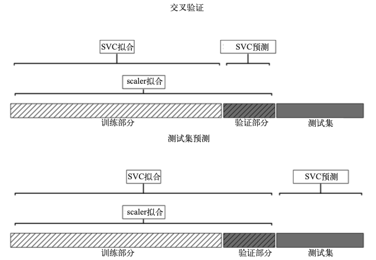
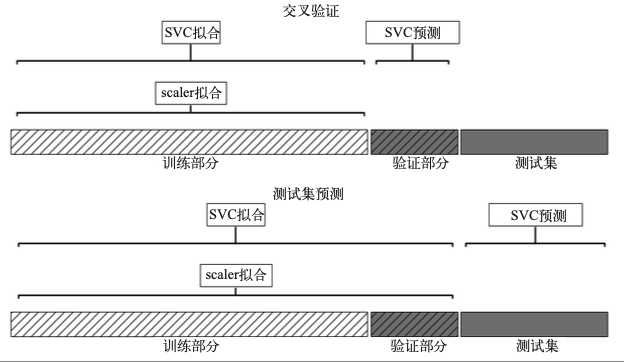
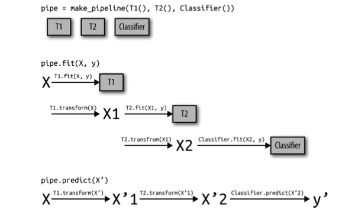

# 算法链与管道

### 一、用预处理进行参数选择

交叉验证中的测试集部分也被训练缩放使用过了。对于模型来说，这些数据与新数据看起来截然不同。上面交叉验证是错误的。



因此，对于建模过程，交叉验证中的划分无法正确地反映新数据的特征。我们已经将这部分数据的信息泄露(leak)给建模过程。这将导致在交叉验证过程中得到 *过于乐观* 的结果， 并可能会导致选择次优的参数。

### 二、构建管道

**Pipeline 类**

例：使用MinMaxScaler缩放数据之后训练SVM（暂时不实用网格）

不用Pipeline

```python
scaler = MinMaxScaler().fit(X_train)
X_train_scaled = scaler.transform(X_train) 
svm = SVC()
svm.fit(X_train_scaled, y_train)
X_test_scaled = scaler.transform(X_test)
print("Test score: {:.2f}".format(svm.score(X_test_scaled, y_test))) 
```

用Pipeline

```python
from sklearn.pipeline import Pipeline
#构建一个由步骤列表组成的管道对象，每个对象包含一个名称和估计器实例
pipe = Pipeline([("scaler", MinMaxScaler()), ("svm", SVC())])
#先对第一个步骤(缩放器)调用 fit，然后使用该缩放器对训练数据进行变换，最后用缩放后的数据来拟合 SVM
pipe.fit(X_train, y_train) 
#在测试数据上进行评估，调用 pipe.score
print("Test score: {:.2f}".format(pipe.score(X_test, y_test))) 
```

利用管道，我们减少了“预处理+分类”过程所需要的代码量

### 三、在网格搜索中使用管道

在指定参数网格时存在一处细微的变化。我们需要为每个参数指定它在管道中所属的步骤。为管 道定义参数网格的语法是为每个参数指定步骤名称，后面加上 \_\_(双下划线)，然后是参 数名称。因此，要想搜索 SVC 的 C 参数，必须使用 "svm\_\_C" 作为参数网格字典的键，对 gamma 参数也是同理。

```python
pipe = Pipeline([("scaler", MinMaxScaler()), ("svm", SVC())])
param_grid = {'svm__C': [0.001, 0.01, 0.1, 1, 10, 100], 
              'svm__gamma': [0.001, 0.01, 0.1, 1, 10, 100]}
grid = GridSearchCV(pipe, param_grid=param_grid, cv=5)
grid.fit(X_train, y_train)
print("Best cross-validation accuracy: {:.2f}".format(grid.best_score_))
print("Test set score: {:.2f}".format(grid.score(X_test, y_test))) 
print("Best parameters: {}".format(grid.best_params_))
```



### 四、通用的管道接口

对于管道中估计器的唯一要求就是，**除了最后一步之外的所有步骤都需要具有 transform 方法**，这样它们可以生成新的数据表示，以供下一个步骤使用。

在调用 Pipeline.fit 的过程中，管道内部依次对每个步骤调用 fit 和 transform，其输入是前一个步骤中 transform 方法的输出。对于管道中的最后一步，则仅调用 fit。

pipeline.steps 是由元组组成的列表， 所以 pipeline.steps\[0]\[1] 是第一个估计器，pipeline.steps\[1]\[1] 是第二个估计器。。。



管道实际上比上图更加通用。管道的最后一步不需要具有 predict 函数，比如说，我们可以创建一个只包含一个缩放器和一个 PCA 的管道。由于最后一步(PCA)具有 transform 方法，所以我们可以对管道调用 transform，以得到将 PCA.transform 应用于前一个步骤处理 过的数据后得到的输出。管道的最后一步只需要具有 fit 方法。

#### 1、用make\_pipeline方便地创建管道

我们通常不需要为每一个步骤提供用户指定的名 称。有一个很方便的函数 make\_pipeline，可以为我们创建管道并根据每个步骤所属的类 为其自动命名。

```python
from sklearn.pipeline import make_pipeline
# 标准语法
pipe_long = Pipeline([("scaler", MinMaxScaler()), ("svm", SVC(C=100))]) 
# 缩写语法，自动命名
pipe_short = make_pipeline(MinMaxScaler(), SVC(C=100))
print("Pipeline steps:\n{}".format(pipe_short.steps))
'''
Pipeline steps:
[('minmaxscaler', MinMaxScaler(copy=True, feature_range=(0, 1))),
('svc', SVC(C=100, cache_size=200, class_weight=None, coef0=0.0,
decision_function_shape=None, degree=3, gamma='auto', 
kernel='rbf', max_iter=-1, probability=False, 
random_state=None, shrinking=True, tol=0.001, 
verbose=False))]
''' 
```

#### 2、访问步骤属性

要想访问管道中的步骤，最简单的方法是通过** named\_steps** 属性，它是一个字典，将 步骤名称映射为估计器

```python
components = pipe.named_steps["pca"].components_ 
print("components.shape: {}".format(components.shape))
```

#### 3、访问网格搜索管道中的属性

由于 我们使用了 make\_pipeline 函数，所以管道中 LogisticRegression 步骤的名称是小写的类 名称 logisticregression。因此，为了调节参数 C，我们必须指定 logisticregression\_\_C 的参数网格

```python
pipe = make_pipeline(StandardScaler(), LogisticRegression())
param_grid = {'logisticregression__C': [0.01, 0.1, 1, 10, 100]}
X_train, X_test, y_train, y_test = train_test_split( cancer.data, cancer.target, random_state=4)
grid = GridSearchCV(pipe, param_grid, cv=5) grid.fit(X_train, y_train)
#第五章学到，GridSearchCV找到的最佳模型保存在 grid.best_estimator_ 
print("Best estimator:\n{}".format(grid.best_estimator_))

'''
Best estimator:
Pipeline(steps=[
    ('standardscaler', StandardScaler(copy=True, with_mean=True, with_std=True)), 
    ('logisticregression', LogisticRegression(C=0.1, class_weight=None, 
    dual=False, fit_intercept=True, intercept_scaling=1, max_iter=100, 
    multi_class='ovr', n_jobs=1, penalty='l2', random_state=None, 
    solver='liblinear', tol=0.0001, verbose=0, warm_start=False))])

''' 
```

best\_estimator\_ 是一个管道，它包含两个步骤:standardscaler 和 logisticregression,我们可以使用管道的 **named\_steps **属性来访问 logisticregression 步骤

```python
print("Logistic regression step:\n{}".format( grid.best_estimator_.named_steps["logisticregression"]))

'''
Logistic regression step:
LogisticRegression(C=0.1, class_weight=None, dual=False, fit_intercept=True,
                    intercept_scaling=1, max_iter=100, multi_class='ovr', n_jobs=1, 
                    penalty='l2', random_state=None, solver='liblinear', tol=0.0001, 
                    verbose=0, warm_start=False)
''' 
```

访问每一个输入特征相关稀疏的权重

```python
print("Logistic regression coefficients:\n{}".format( 
grid.best_estimator_.named_steps["logisticregression"].coef_))

'''
Logistic regression coefficients:
[[-0.389 -0.375 -0.376 -0.396 -0.115 0.017 -0.355 -0.39 -0.058 0.209
  -0.495 -0.004 -0.371 -0.383 -0.045 0.198 0.004 -0.049 0.21 0.224 
  -0.547 -0.525 -0.499 -0.515 -0.393 -0.123 -0.388 -0.417 -0.325 -0.139]]
'''

```

### 五、 网格搜索预处理步骤与模型参数

例：管道包含 3 个步骤:缩放数据、计算多项 式特征与岭回归

```python
pipe = make_pipeline(StandardScaler(),PolynomialFeatures(),Ridge())
param_grid = {'polynomialfeatures__degree': [1, 2, 3], 
              'ridge__alpha': [0.001, 0.01, 0.1, 1, 10, 100]}
grid = GridSearchCV(pipe, param_grid=param_grid, cv=5, n_jobs=-1) 
grid.fit(X_train, y_train)

```

### 六、 网格搜索选择使用哪个模型

例：在 iris 数据集上比较 RandomForestClassifier 和 SVC。我们知道，SVC 可能需要对数据进行缩放，所以我们还需要搜索是使用 StandardScaler 还是不使用预处 理。我们知道，RandomForestClassifier 不需要预处理。

为了将一个估计器分配给一个步骤，我们使用步骤名称作为参数名称。如果我们想跳过管道中的某个步骤(例 如，RandomForest 不需要预处理)，则可以将该步骤设置为 None:

```python
param_grid = [
{'classifier': [SVC()], 'preprocessing': [StandardScaler(), None],
'classifier__gamma': [0.001, 0.01, 0.1, 1, 10, 100],
'classifier__C': [0.001, 0.01, 0.1, 1, 10, 100]}, 

{'classifier': [RandomForestClassifier(n_estimators=100)],
'preprocessing': [None], 'classifier__max_features': [1, 2, 3]}]

X_train, X_test, y_train, y_test = train_test_split( cancer.data, cancer.target, random_state=0)
grid = GridSearchCV(pipe, param_grid, cv=5) 
grid.fit(X_train, y_train) 
```
