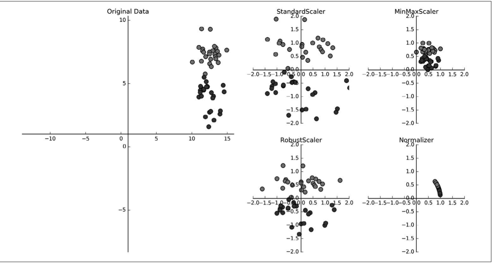

# 预处理与缩放

一些算法（如svm）对数据缩放非常敏感，因此，通常的 做法是对特征进行调节，使数据表示更适合于这些算法。通常来说，这是对数据的一种简单的按特征的缩放和移动。



-   **StandardScaler**** 确保每个特征的平均值为 0、方差为 1，使所有特征都位于同一量级**。但这种缩放不能保证特征任何特定的最大值和最小值。
-   **RobustScaler** 的工作原理与 StandardScaler 类似，**RobustScaler 使用的是中位数和四分位数确保每个特征的统计属性都位于同一范围。而不是平均值和方差**。这样 RobustScaler 会忽略与其他点有很大不 同的数据点(比如测量误差)。这些与众不同的数据点也叫异常值(outlier)，可能会给其 他缩放方法造成麻烦。
-   **MinMaxScaler**** 移动数据，使所有特征都刚好位于 0 到 1 之间**。对于二维数据集来说，所有的数据都包含在 x 轴 0到 1 与 y 轴 0 到 1 组成的矩形中。
-   **Normalizer**** 用到一种完全不同的缩放方法。它对每个数据点进行缩放，使得特征向 量的欧式长度等于 1。**换句话说，它将一个数据点投射到半径为 1 的圆上(对于更高维度 的情况，是球面)。这意味着每个数据点的缩放比例都不相同(乘以其长度的倒数)。如果 只有数据的方向(或角度)是重要的，而特征向量的长度无关紧要，那么通常会使用这种归一化。

使用方法如下

```python
from sklearn.preprocessing import MinMaxScaler
scaler = MinMaxScaler() 
#fit 方法计算训练集中每个特征的最大值和最小值
scaler.fit(X_train) 
# 对训练数据进行变换
X_train_scaled = scaler.transform(X_train)
# 对测试数据进行变换
X_test_scaled = scaler.transform(X_test)

'''
对测试集缩放后的最大值和最小值不是 1 和 0
对此的解释是，MinMaxScaler(以及其他所有缩放器)总是对训练集和测试集应用完全相同的变换。
也就是说，transform 方法总是减去训练集的最小值，然后除以训练集的范围，
而这两个值可能与测试集的最小值和范围并不相同。
''' 
```

**千万千万不能用两个scaler分别fit训练集和测试集，然后分别变换！**

上述代码高效替代方法fit\_transform( )

```python
from sklearn.preprocessing import StandardScaler 
scaler = StandardScaler()
# 依次调用fit和transform(使用方法链)
X_scaled = scaler.fit(X).transform(X)
# 结果相同，但计算更加高效 
X_scaled_d = scaler.fit_transform(X)
```
